# System Architecture

> Last updated: 2026-03-03 (Phase 5: heartbeat, chat, memory commands, voice upgrades)
> This document describes the full AAGLOBAL system for Troy, Claude Code agents, Cursor, and OutBot.

## How to Use This System

There are **three interfaces** into this system. They share files but can run independently.

### 1. Command Centre TUI (the unified hub)

**How to start:** Run `cc` from any terminal.

```bash
cc
```

The Command Centre is a keyboard-driven terminal TUI (built with Textual) that unifies task management, OutBot chat, email, Telegram, and daily review into one interface.

**Key features:**
- 3x3 tile grid showing tasks with Eisenhower quadrant colours
- **Hierarchical drill-down**: Enter on parent → shows children; Enter on leaf → Task Focus View
- **Task Focus View**: single-task control centre with field-by-field editing, notes, PRD promotion, and research viewer (Up/Down, Enter to edit, n to add note, p to open/create PRD, Escape to back out)
- **Command Palette**: / key opens navigable modal with commands, agents, and skills (arrow keys + filter)
- **Filter Picker**: : key opens navigable modal with quadrant, overdue, today filters + freetext search
- **AI Progress Log**: step-by-step progress with elapsed timer (not just "Thinking...")
- **Navigation stack**: Escape goes back through levels (focus → children → parent → all tasks)
- Space = select, Enter = drill down (separated from v1 where both toggled select)
- Multi-select tasks + batch operations (done, move quadrant, enrich)
- Context panel with task detail, progress log, and OutBot responses
- Voice mode — record audio, transcribe, route through OutBot
- Brain predictions on launch (day-of-week patterns, incomplete yesterday)
- Task editing modal (title, quadrant, priority, due date, description)
- **Chat panel** — togglable sidebar (c key) with persistent conversation history, task-aware context
- **Heartbeat bridge** — background scheduler checks for overdue tasks, shows notifications in-app
- **Telegram bridge** — live connection status, incoming message notifications
- **Memory commands** — /remember and /forget for explicit memory management (shared with OutBot)
- Email inbox/outbox via Gmail, import unread emails as tasks (syncs to iOS)
- Add timestamped notes to tasks via command palette
- **Quick sync** — `sync --quick` fetches only last 24h of reminders (avoids timeout with large reminder counts)
- Slash commands: /done, /today, /enrich, /research, /daily, /inbox, /import, /email, /agent, /skill, /remember, /forget, /telegram, /help

### 2. Claude Code Agents (the task management system)

**How to start:** Open a terminal and run `claude` from the AAGLOBAL root directory.

```bash
cd ~/CODE/AAGLOBAL
claude
```

Then speak naturally:

| What you say | What happens |
|---|---|
| "do my daily review" | Overseer runs the full daily pipeline |
| "start my day" | Same as daily review |
| "import my reminders" | Imports from macOS Reminders.app |
| "enrich all bare tasks" | Enricher adds real steps to stub tasks |
| "wrangle overdue" | Overdue Wrangler assesses stale items |
| "show me my Q1 tasks" | Shows urgent + important priorities |
| "what should I work on?" | Shows priorities and offers to start a task |
| "run overseer" | Full system health check |
| "audit my agents" | Meta Agent reviews the whole system |

Claude Code reads the agent definitions from `.claude/agents/` and follows their instructions. You don't need to reference the files — just describe what you want.

### 3. OutBot (the conversational AI)

**How to start:**

```bash
# CLI chat mode
cd ~/CODE/AAGLOBAL
python brain/chat.py

# CLI voice mode
python brain/chat.py --voice

# Telegram mode (requires bot token from @BotFather)
python brain/main.py
```

OutBot is a conversational assistant. It can:
- Chat with personality (loaded from `.claude/memory/SOUL.md`)
- Remember things ("remember that Kate prefers Tuesday meetings")
- Recall context ("what did we discuss last time?")
- Check and send email (Gmail integration)
- Run background heartbeat checks (Telegram mode)
- Proactively nudge you via Telegram (overdue tasks, reminders, etc.)

OutBot can now run the **daily review workflow** natively (sync reminders, generate dashboard, check overdue) via `brain/workflows/daily_review.py`. Say "daily review" or "start my day" in CLI chat or Telegram.

### 4. Cursor IDE

Cursor can read all files in this workspace. It uses `CLAUDE.md` at the root and any `.cursor/rules/` for context. Cursor is for coding, editing files, and building features — not for running the agent pipelines.

---

## Architecture Diagram

```mermaid
graph TB
    subgraph USER["Troy"]
        CC["Terminal<br/><code>cc</code>"]
        Terminal["Terminal<br/><code>claude</code>"]
        Chat["Terminal<br/><code>python brain/chat.py</code>"]
        Telegram["Telegram<br/>(phone)"]
        CursorIDE["Cursor IDE"]
    end

    subgraph COMMAND_CENTRE["Command Centre TUI"]
        direction TB
        TileGrid["Tile Grid<br/><i>3x3 task tiles</i>"]
        ContextPanel["Context Panel<br/><i>detail + responses</i>"]
        CommandBar["Command Bar<br/><i>slash commands + OutBot</i>"]
        VoiceMode["Voice Mode<br/><i>record + transcribe</i>"]
        TGBridge["Telegram Bridge<br/><i>background connection</i>"]
        EmailHandler["Email Handler<br/><i>inbox + outbox</i>"]
        CommandPalette["Command Palette<br/><i>commands + agents + skills</i>"]
        Predictions["Predictions<br/><i>brain-log analysis</i>"]
    end

    subgraph CLAUDE_CODE["Claude Code (Agent System)"]
        direction TB
        Overseer["Overseer<br/><i>orchestrator</i>"]

        subgraph PIPELINE["Daily Review Pipeline"]
            direction LR
            Importer["Reminders<br/>Importer"]
            Enricher["Work Item<br/>Enricher"]
            Wrangler["Overdue<br/>Wrangler"]
            Dashboard["Dashboard<br/>Generator"]
            Importer --> Enricher --> Wrangler --> Dashboard
        end

        subgraph ON_DEMAND["On-Demand Agents"]
            Tracker["Work<br/>Tracker"]
            MemWriter["Memory<br/>Writer"]
            NavUpdater["Navigator<br/>Updater"]
        end

        subgraph WEEKLY["Weekly Review"]
            MetaAgent["Meta<br/>Agent"]
        end

        Overseer --> PIPELINE
        Overseer --> ON_DEMAND
        Overseer --> WEEKLY
    end

    subgraph OUTBOT["OutBot (Conversational AI)"]
        direction TB
        CLIChat["CLI Chat<br/><code>chat.py</code>"]
        Voice["Voice Mode<br/><code>voice.py</code>"]
        TGBot["Telegram Bot<br/><code>main.py</code>"]
        Heartbeat["Heartbeat<br/>Scheduler"]

        subgraph CAPABILITIES["Capabilities"]
            Remember["Remember"]
            Recall["Recall"]
            Reflect["Reflection"]
            Mail["Email<br/>Inbox/Outbox"]
        end

        CLIChat --> CAPABILITIES
        Voice --> CAPABILITIES
        TGBot --> CAPABILITIES
        TGBot --> Heartbeat
    end

    subgraph SHARED["Shared File System"]
        direction TB
        Memory[".claude/memory/<br/>SOUL.md, USER.md,<br/>NAVIGATOR.md, AGENTS.md"]
        Work[".claude/work/<br/>tasks/, bugs/, prd/"]
        Skills[".claude/skills/<br/>26 skills"]
        Dashboards[".claude/dashboards/<br/>Eisenhower HTML"]
        Reminders[".claude/reminders/<br/>macOS sync"]
        Config[".claude/config/<br/>settings"]
    end

    subgraph EXTERNAL["External Services"]
        macOS["macOS<br/>Reminders.app"]
        Gmail["Gmail<br/>IMAP/SMTP"]
        GitHub["GitHub<br/>outtram/agentic-workspace"]
        ClaudeCLI["Claude CLI<br/>(Max plan)"]
        TelegramAPI["Telegram<br/>Bot API"]
    end

    CC --> COMMAND_CENTRE
    Terminal --> CLAUDE_CODE
    Chat --> CLIChat
    Telegram --> TGBot
    CursorIDE -.->|reads| SHARED

    COMMAND_CENTRE -->|reads/writes| SHARED
    COMMAND_CENTRE -->|routes through| OUTBOT
    TGBridge -->|connects to| TelegramAPI
    EmailHandler -->|reads/sends| Gmail
    CLAUDE_CODE -->|reads/writes| SHARED
    OUTBOT -->|reads/writes| SHARED

    Importer -->|imports from| macOS
    Mail -->|reads/sends| Gmail
    CLAUDE_CODE -->|powered by| ClaudeCLI
    OUTBOT -->|powered by| ClaudeCLI
    COMMAND_CENTRE -->|powered by| ClaudeCLI
    Dashboard -->|publishes to| GitHub

    style COMMAND_CENTRE fill:#1a1a2e,stroke:#FF6B35,color:#fff
    style CLAUDE_CODE fill:#1a1a2e,stroke:#e94560,color:#fff
    style OUTBOT fill:#1a1a2e,stroke:#0f3460,color:#fff
    style SHARED fill:#16213e,stroke:#533483,color:#fff
    style EXTERNAL fill:#0f3460,stroke:#e94560,color:#fff
    style USER fill:#533483,stroke:#e94560,color:#fff
```



---

## Component Details

### Command Centre TUI

The Command Centre lives in `brain/command_centre/` and is a Textual-based TUI launched via `cc`.

| Component | File | Purpose |
|---|---|---|
| **App** | `app.py` | Main Textual app — state, key handling, widget composition |
| **Tile Grid** | `tile_grid.py` | 3x3 task tile grid with quadrant colours, hierarchy badges |
| **Context Panel** | `context_panel.py` | Task detail, response display, action suggestions |
| **Command Bar** | `command_bar.py` | Input for slash commands, filters, natural language |
| **Status Bar** | `status_bar.py` | Hints + counts (tasks, today, overdue, telegram, voice) |
| **Router** | `router.py` | Routes input to slash handlers or OutBot natural language |
| **Task Editor** | `task_editor.py` | Modal for editing task fields (title, quadrant, due, etc.) |
| **Command Palette** | `command_palette.py` | Navigable modal: commands, agents, skills (/ key). Deferred dismiss via call_later |
| **Filter Picker** | `filter_picker.py` | Navigable modal: q1-q4, overdue, today filters (: key). Deferred dismiss via call_later |
| **Task Focus** | `task_focus.py` | Single-task view with field editing + research/notes viewer |
| **Telegram Bridge** | `telegram_bridge.py` | Background Telegram connection + message forwarding |
| **Heartbeat Bridge** | `heartbeat_bridge.py` | Background 60s scheduler — checks overdue tasks, shows toast notifications |
| **Voice Handler** | `handlers/voice.py` | Recording via sounddevice, transcription via faster-whisper, TTS via macOS say |
| **Predictions** | `predictions.py` | Brain-log analysis for launch-time suggestions |
| **Skill Matcher** | `skill_matcher.py` | Keyword matching for agent/skill suggestions |
| **Help Generator** | `help_gen.py` | Generates HELP.md, _HELP_TEXT, /help from `help_data.yml` (single source of truth) |
| **Handlers** | `handlers/` | Slash command implementations (triage, enrich, research, email, agents, memory, voice) |

### Claude Code Agents

All agent definitions live in `.claude/agents/`. Claude Code reads these as instructions when you ask it to do something.

| Agent | File | Purpose | Trigger |
|---|---|---|---|
| **Overseer** | `overseer.md` | Orchestrates all other agents in pipelines | Session start, "daily review" |
| **Reminders Importer** | `reminders-importer.md` | Imports macOS Reminders into `.claude/work/tasks/` | Via overseer, "import reminders" |
| **Work Item Enricher** | `work-item-enricher.md` | Adds real steps, categories, Eisenhower classification to stub tasks | After import, "enrich tasks" |
| **Overdue Wrangler** | `overdue-wrangler.md` | Reviews overdue items; proposes reschedule/archive/escalate/clarify | Daily, "wrangle overdue" |
| **Dashboard Generator** | `dashboard-generator.md` | Generates Eisenhower Matrix HTML dashboards | After changes, "generate dashboard" |
| **Work Tracker** | `work-tracker.md` | CRUD for PRDs, bugs, and tasks | On demand |
| **Memory Writer** | `memory-writer.md` | Updates YAML memory domains (projects, skills, patterns, decisions) | On demand |
| **Navigator Updater** | `navigator-updater.md` | Keeps `NAVIGATOR.md` index current | After new agents/skills added |
| **Meta Agent** | `meta-agent.md` | Audits the system; recommends new agents, skills, upgrades | Weekly, "audit my agents" |

### Pipelines (run by Overseer)

```
Daily Review:    Importer → Enricher → Wrangler → Dashboard → Briefing
Post-Import:     Enricher → Dashboard
Session Start:   Health check → report counts → offer daily review
Weekly Review:   Daily pipeline + Meta Agent + Navigator Updater + Memory Writer
```

### OutBot Components

| Component | File | Purpose |
|---|---|---|
| **CLI Chat** | `brain/chat.py` | Terminal-based chat with Claude |
| **Voice** | `brain/voice.py` | Speech-to-text + text-to-speech chat |
| **Telegram Bot** | `brain/main.py` → `brain/orchestrator.py` | Telegram messaging via Bot API |
| **Heartbeat** | `brain/heartbeat/scheduler.py` | Background task scheduler (Telegram mode) |
| **Remember** | `brain/memory/remember.py` | Saves facts to `.claude/memory/USER.md` |
| **Recall** | `brain/memory/recall.py` | Searches conversation archives and memory |
| **Reflection** | `brain/memory/reflection.py` | End-of-session pattern analysis |
| **Inbox** | `brain/mail/inbox.py` | Gmail IMAP email checking |
| **Outbox** | `brain/mail/outbox.py` | Gmail SMTP email sending |
| **Daily Review** | `brain/workflows/daily_review.py` | Sync reminders, generate dashboard, check overdue — pure Python |
| **Claude Client** | `brain/core/claude_client.py` | Calls `claude --print` (Max plan, no API key) |
| **Telegram Adapter** | `brain/telegram/bot.py` | Telegram Bot API long-polling adapter |
| **Telegram Formatter** | `brain/telegram/formatter.py` | Converts markdown to Telegram HTML |
| **Personality** | `brain/personality/loader.py` | Loads SOUL.md, USER.md for OutBot's voice |

### Shared File System

Both Claude Code and OutBot read/write these:

```
.claude/
├── agents/              # 9 agent definitions (Claude Code reads these)
├── config/              # Import settings, mobile dashboard config
├── dashboards/          # Generated Eisenhower HTML files
├── hooks/               # Session start hooks
├── memory/
│   ├── NAVIGATOR.md     # Grep-optimised index (both systems)
│   ├── USER.md          # Troy's profile and preferences (both systems)
│   ├── SOUL.md          # OutBot personality (OutBot reads this)
│   ├── AGENTS.md        # OutBot operating instructions (OutBot reads this)
│   ├── HEARTBEAT.md     # OutBot heartbeat config (OutBot reads this)
│   ├── meta-agent-log.yml
│   ├── decisions/       # Architectural decisions (YAML)
│   ├── patterns/        # Successful workflows (YAML)
│   ├── projects/        # Active projects (YAML)
│   └── skills/          # Learned skills (YAML)
├── reminders/           # Python package for macOS Reminders sync
├── scripts/             # Standalone Python scripts
├── skills/              # 18 skill definitions
├── templates/           # HTML templates for dashboards
└── work/
    ├── tasks/           # Active tasks (OUT-201+)
    ├── bugs/            # Active bugs (OUT-101+)
    ├── prd/             # Product requirements (OUT-001+)
    └── done/            # Completed items (archived here)
```

### Skills (18 available)

Skills are specialised instructions Claude Code can follow for specific tasks:

| Skill | Purpose |
|---|---|
| daily-review | Daily review workflow |
| pptx | PowerPoint generation |
| pptx-arch-diagrams | Architecture diagrams in PPTX |
| docx | Word document generation |
| xlsx | Excel with recalculation |
| pdf | PDF generation |
| superpowers | TDD testing workflow |
| webapp-testing | Web app testing |
| frontend-design | Frontend design tools |
| canvas-design | Canvas design |
| algorithmic-art | Algorithmic art generation |
| brand-guidelines | Brand guideline management |
| theme-factory | Theme generation (10 presets) |
| slack-gif-creator | Animated Slack GIFs |
| web-artifacts-builder | Web artifact bundling |
| mcp-builder | MCP server builder |
| internal-comms | Internal communications |
| skill-creator | Create new skills |

---

## How the Three Systems Connect

```
                    ┌─────────────────────────────────┐
                    │     Shared File System           │
                    │  .claude/memory/  .claude/work/  │
                    └───────┬──────────┬──────────┬────┘
                            │          │          │
                 ┌──────────┘          │          └──────────┐
                 │                     │                     │
         ┌───────▼────────┐   ┌───────▼────────┐   ┌───────▼────────┐
         │ Command Centre │   │  Claude Code   │   │    OutBot       │
         │  (TUI hub)     │   │  (Agents)      │   │  (Chat/Telegram)│
         ├────────────────┤   ├────────────────┤   ├─────────────────┤
         │ Task tiles     │   │ Reads agents/  │   │ Reads memory/   │
         │ Slash commands │   │ Writes work/   │   │ Writes memory/  │
         │ OutBot chat    │   │ Writes memory/ │   │ Reads work/     │
         │ Email in/out   │   │ Runs pipelines │   │ Chats, emails   │
         │ Telegram bridge│   │                │   │ Heartbeat       │
         │ Voice mode     │   │                │   │                 │
         ├────────────────┤   ├────────────────┤   ├─────────────────┤
         │ HOW: terminal  │   │ HOW: terminal  │   │ HOW: terminal   │
         │ > cc           │   │ > claude       │   │ > outbot        │
         └────────────────┘   └────────────────┘   └─────────────────┘
```

**They are complementary:**
- **Command Centre** is the unified hub — tasks, chat, email, telegram, voice in one TUI
- Claude Code agents **manage your work** (import, enrich, prioritise, track)
- OutBot **talks to you** (chat, remember, email, nudge via Telegram)
- All three read and write to the same files, so changes from one are visible to the others

**Shared workflows:** The `brain/workflows/` module provides pure Python implementations of key pipelines (daily review, etc.) that all three systems can call. No shell execution needed — they import the reminders manager and dashboard generator directly.

---

## Keeping This Document Current

This file should be updated when:
- A new agent is added or removed
- A new skill is added
- The OutBot capabilities change
- The file structure changes
- A new integration is added (e.g., calendar, Slack)

**Who updates it:**
- The **Navigator Updater** agent should reference this file
- The **Meta Agent** should check if this doc is stale during weekly review
- Any human or AI making structural changes should update this doc

To check freshness:
```bash
# When was this doc last updated?
head -3 docs/ARCHITECTURE.md

# Compare against latest agent changes
ls -lt .claude/agents/*.md | head -5
```
