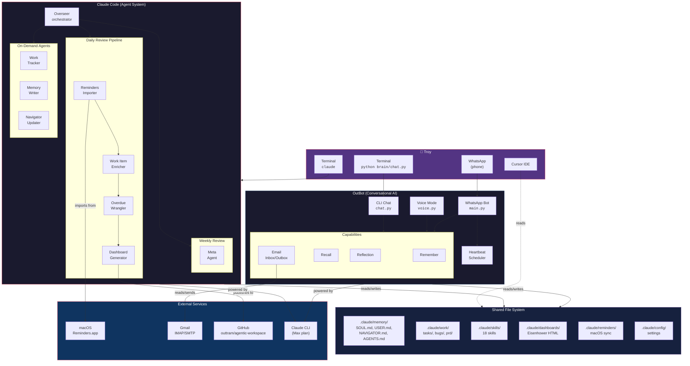

# System Architecture

> Last updated: 2026-02-22 (Telegram replaces WhatsApp)
> This document describes the full AAGLOBAL system for Troy, Claude Code agents, Cursor, and OutBot.

## How to Use This System

There are **two separate interfaces** into this system. They share files but run independently.

### 1. Claude Code Agents (the task management system)

**How to start:** Open a terminal and run `claude` from the AAGLOBAL root directory.

```bash
cd ~/CODE/AAGLOBAL
claude
```

Then speak naturally:

| What you say | What happens |
|---|---|
| "do my daily review" | Overseer runs the full daily pipeline |
| "start my day" | Same as daily review |
| "import my reminders" | Imports from macOS Reminders.app |
| "enrich all bare tasks" | Enricher adds real steps to stub tasks |
| "wrangle overdue" | Overdue Wrangler assesses stale items |
| "show me my Q1 tasks" | Shows urgent + important priorities |
| "what should I work on?" | Shows priorities and offers to start a task |
| "run overseer" | Full system health check |
| "audit my agents" | Meta Agent reviews the whole system |

Claude Code reads the agent definitions from `.claude/agents/` and follows their instructions. You don't need to reference the files — just describe what you want.

### 2. OutBot (the conversational AI)

**How to start:**

```bash
# CLI chat mode
cd ~/CODE/AAGLOBAL
python brain/chat.py

# CLI voice mode
python brain/chat.py --voice

# Telegram mode (requires bot token from @BotFather)
python brain/main.py
```

OutBot is a conversational assistant. It can:
- Chat with personality (loaded from `.claude/memory/SOUL.md`)
- Remember things ("remember that Kate prefers Tuesday meetings")
- Recall context ("what did we discuss last time?")
- Check and send email (Gmail integration)
- Run background heartbeat checks (Telegram mode)
- Proactively nudge you via Telegram (overdue tasks, reminders, etc.)

**OutBot does NOT run the Claude Code agents.** It reads the same memory files but is a separate runtime.

### 3. Cursor IDE

Cursor can read all files in this workspace. It uses `CLAUDE.md` at the root and any `.cursor/rules/` for context. Cursor is for coding, editing files, and building features — not for running the agent pipelines.

---

## Architecture Diagram



---

## Component Details

### Claude Code Agents

All agent definitions live in `.claude/agents/`. Claude Code reads these as instructions when you ask it to do something.

| Agent | File | Purpose | Trigger |
|---|---|---|---|
| **Overseer** | `overseer.md` | Orchestrates all other agents in pipelines | Session start, "daily review" |
| **Reminders Importer** | `reminders-importer.md` | Imports macOS Reminders into `.claude/work/tasks/` | Via overseer, "import reminders" |
| **Work Item Enricher** | `work-item-enricher.md` | Adds real steps, categories, Eisenhower classification to stub tasks | After import, "enrich tasks" |
| **Overdue Wrangler** | `overdue-wrangler.md` | Reviews overdue items; proposes reschedule/archive/escalate/clarify | Daily, "wrangle overdue" |
| **Dashboard Generator** | `dashboard-generator.md` | Generates Eisenhower Matrix HTML dashboards | After changes, "generate dashboard" |
| **Work Tracker** | `work-tracker.md` | CRUD for PRDs, bugs, and tasks | On demand |
| **Memory Writer** | `memory-writer.md` | Updates YAML memory domains (projects, skills, patterns, decisions) | On demand |
| **Navigator Updater** | `navigator-updater.md` | Keeps `NAVIGATOR.md` index current | After new agents/skills added |
| **Meta Agent** | `meta-agent.md` | Audits the system; recommends new agents, skills, upgrades | Weekly, "audit my agents" |

### Pipelines (run by Overseer)

```
Daily Review:    Importer → Enricher → Wrangler → Dashboard → Briefing
Post-Import:     Enricher → Dashboard
Session Start:   Health check → report counts → offer daily review
Weekly Review:   Daily pipeline + Meta Agent + Navigator Updater + Memory Writer
```

### OutBot Components

| Component | File | Purpose |
|---|---|---|
| **CLI Chat** | `brain/chat.py` | Terminal-based chat with Claude |
| **Voice** | `brain/voice.py` | Speech-to-text + text-to-speech chat |
| **Telegram Bot** | `brain/main.py` → `brain/orchestrator.py` | Telegram messaging via Bot API |
| **Heartbeat** | `brain/heartbeat/scheduler.py` | Background task scheduler (Telegram mode) |
| **Remember** | `brain/memory/remember.py` | Saves facts to `.claude/memory/USER.md` |
| **Recall** | `brain/memory/recall.py` | Searches conversation archives and memory |
| **Reflection** | `brain/memory/reflection.py` | End-of-session pattern analysis |
| **Inbox** | `brain/mail/inbox.py` | Gmail IMAP email checking |
| **Outbox** | `brain/mail/outbox.py` | Gmail SMTP email sending |
| **Claude Client** | `brain/core/claude_client.py` | Calls `claude --print` (Max plan, no API key) |
| **Telegram Adapter** | `brain/telegram/bot.py` | Telegram Bot API long-polling adapter |
| **Telegram Formatter** | `brain/telegram/formatter.py` | Converts markdown to Telegram HTML |
| **Personality** | `brain/personality/loader.py` | Loads SOUL.md, USER.md for OutBot's voice |

### Shared File System

Both Claude Code and OutBot read/write these:

```
.claude/
├── agents/              # 9 agent definitions (Claude Code reads these)
├── config/              # Import settings, mobile dashboard config
├── dashboards/          # Generated Eisenhower HTML files
├── hooks/               # Session start hooks
├── memory/
│   ├── NAVIGATOR.md     # Grep-optimised index (both systems)
│   ├── USER.md          # Troy's profile and preferences (both systems)
│   ├── SOUL.md          # OutBot personality (OutBot reads this)
│   ├── AGENTS.md        # OutBot operating instructions (OutBot reads this)
│   ├── HEARTBEAT.md     # OutBot heartbeat config (OutBot reads this)
│   ├── meta-agent-log.yml
│   ├── decisions/       # Architectural decisions (YAML)
│   ├── patterns/        # Successful workflows (YAML)
│   ├── projects/        # Active projects (YAML)
│   └── skills/          # Learned skills (YAML)
├── reminders/           # Python package for macOS Reminders sync
├── scripts/             # Standalone Python scripts
├── skills/              # 18 skill definitions
├── templates/           # HTML templates for dashboards
└── work/
    ├── tasks/           # Active tasks (OUT-201+)
    ├── bugs/            # Active bugs (OUT-101+)
    ├── prd/             # Product requirements (OUT-001+)
    └── done/            # Completed items (archived here)
```

### Skills (18 available)

Skills are specialised instructions Claude Code can follow for specific tasks:

| Skill | Purpose |
|---|---|
| daily-review | Daily review workflow |
| pptx | PowerPoint generation |
| pptx-arch-diagrams | Architecture diagrams in PPTX |
| docx | Word document generation |
| xlsx | Excel with recalculation |
| pdf | PDF generation |
| superpowers | TDD testing workflow |
| webapp-testing | Web app testing |
| frontend-design | Frontend design tools |
| canvas-design | Canvas design |
| algorithmic-art | Algorithmic art generation |
| brand-guidelines | Brand guideline management |
| theme-factory | Theme generation (10 presets) |
| slack-gif-creator | Animated Slack GIFs |
| web-artifacts-builder | Web artifact bundling |
| mcp-builder | MCP server builder |
| internal-comms | Internal communications |
| skill-creator | Create new skills |

---

## How the Two Systems Connect

```
                    ┌─────────────────────────────────┐
                    │     Shared File System           │
                    │  .claude/memory/  .claude/work/  │
                    └──────────┬──────────┬────────────┘
                               │          │
                    ┌──────────┘          └──────────┐
                    │                                │
            ┌───────▼────────┐              ┌───────▼────────┐
            │  Claude Code   │              │    OutBot       │
            │  (Agents)      │              │  (Chat/WhatsApp)│
            ├────────────────┤              ├─────────────────┤
            │ Reads agents/  │              │ Reads memory/   │
            │ Writes work/   │              │ Writes memory/  │
            │ Writes memory/ │              │ Reads work/     │
            │ Runs pipelines │              │ Chats, emails   │
            ├────────────────┤              ├─────────────────┤
            │ HOW: terminal  │              │ HOW: terminal   │
            │ > claude       │              │ > python chat.py│
            │ "daily review" │              │ or WhatsApp     │
            └────────────────┘              └─────────────────┘
```

**They are complementary:**
- Claude Code agents **manage your work** (import, enrich, prioritise, track)
- OutBot **talks to you** (chat, remember, email, nudge via WhatsApp)
- Both read and write to the same files, so changes from one are visible to the other

**Future integration:** The OutBot heartbeat scheduler could trigger Claude Code agent pipelines via IPC, making the system fully autonomous. This is noted in the overseer as a future enhancement.

---

## Keeping This Document Current

This file should be updated when:
- A new agent is added or removed
- A new skill is added
- The OutBot capabilities change
- The file structure changes
- A new integration is added (e.g., calendar, Slack)

**Who updates it:**
- The **Navigator Updater** agent should reference this file
- The **Meta Agent** should check if this doc is stale during weekly review
- Any human or AI making structural changes should update this doc

To check freshness:
```bash
# When was this doc last updated?
head -3 docs/ARCHITECTURE.md

# Compare against latest agent changes
ls -lt .claude/agents/*.md | head -5
```
