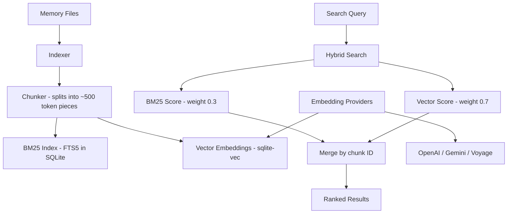

# 01: Memory System Architecture

## Overview

The memory system is how an AI agent **remembers** across conversations. Without it, every interaction starts from scratch. Both NanoClaw and OpenClaw solve this differently — NanoClaw keeps it dead simple (file-based), while OpenClaw goes full hybrid search (SQL + vector embeddings).

**Why it matters:** Memory is what makes an agent feel like it *knows you*. It's the difference between "tell me about yourself again" and "I remember you prefer dark mode and hate morning meetings."

---

## NanoClaw's Memory System (Primary)

### Architecture

NanoClaw uses a **hierarchical file-based memory** powered by `CLAUDE.md` files. No databases for memory, no vector embeddings — just markdown files that Claude reads automatically.

```mermaid
graph TD
    A[Agent starts in container] --> B[Claude SDK loads CLAUDE.md files]
    B --> C[Global Memory: groups/CLAUDE.md]
    B --> D[Group Memory: groups/{name}/CLAUDE.md]
    B --> E[Extra Files: groups/{name}/*.md]
    
    F[User says 'remember this'] --> G[Agent writes to CLAUDE.md]
    H[User says 'remember globally'] --> I[Main agent writes to global CLAUDE.md]
    
    J[Conversation Archives] --> K[groups/{name}/conversations/]
    K --> L[Date-prefixed .md files]
```

### Key Components

#### 1. Hierarchical CLAUDE.md Files

| Level | Location | Read By | Written By | Purpose |
|-------|----------|---------|------------|---------|
| **Global** | `groups/CLAUDE.md` | All groups | Main only | Shared preferences, facts |
| **Group** | `groups/{name}/CLAUDE.md` | That group | That group | Group-specific memory |
| **Files** | `groups/{name}/*.md` | That group | That group | Notes, research, docs |

**How it loads automatically:**

```typescript
// From container/agent-runner/src/index.ts
for await (const message of query({
  prompt: stream,
  options: {
    cwd: '/workspace/group',                    // Agent runs in group folder
    settingSources: ['project', 'user'],        // Loads CLAUDE.md from cwd and parent
    systemPrompt: globalClaudeMd
      ? { type: 'preset', preset: 'claude_code', append: globalClaudeMd }
      : undefined,
    // ...
  }
})) { /* ... */ }
```

The Claude Agent SDK auto-discovers `CLAUDE.md` from the working directory and its parent. NanoClaw exploits this by setting `cwd` to the group folder — so `./CLAUDE.md` is group memory, and `../CLAUDE.md` (global) gets injected via `systemPrompt.append`.

#### 2. Conversation Archiving (Session Memory)

Before context compaction (when the context window fills up), NanoClaw archives the full transcript to searchable markdown files:

```typescript
// From container/agent-runner/src/index.ts - createPreCompactHook()
function createPreCompactHook(): HookCallback {
  return async (input, _toolUseId, _context) => {
    const preCompact = input as PreCompactHookInput;
    const transcriptPath = preCompact.transcript_path;
    // ...
    const conversationsDir = '/workspace/group/conversations';
    fs.mkdirSync(conversationsDir, { recursive: true });

    const date = new Date().toISOString().split('T')[0];
    const filename = `${date}-${name}.md`;
    // Saves formatted markdown with User/Andy messages
  };
}
```

**Result:** `groups/{name}/conversations/2026-02-15-topic-summary.md` — the agent can `grep` or `Glob` these files to recall old conversations.

#### 3. SQLite for Messages (Not Memory)

NanoClaw uses SQLite for **message routing**, not memory storage:

```typescript
// From src/db.ts
CREATE TABLE IF NOT EXISTS messages (
  id TEXT, chat_jid TEXT, sender TEXT, sender_name TEXT,
  content TEXT, timestamp TEXT, is_from_me INTEGER,
  PRIMARY KEY (id, chat_jid)
);
```

This stores WhatsApp messages for the polling loop to detect new messages. The agent itself never queries this database for "memory" — it reads CLAUDE.md files instead.

### NanoClaw Memory Strengths

- **Dead simple** — no vector DB, no embeddings, no search index
- **Human-readable** — you can open CLAUDE.md and see exactly what the agent knows
- **Tamper-proof hierarchy** — non-main groups can't write to global memory
- **Auto-loading** — Claude SDK handles it, zero custom code needed
- **Searchable** — agent can use `Grep` and `Glob` tools on conversation archives

### NanoClaw Memory Weaknesses

- **No semantic search** — can't find "that email about the budget" unless exact words match
- **Context window limited** — large CLAUDE.md files consume context tokens
- **Manual curation** — user must explicitly say "remember this"
- **No forgetting strategy** — files grow indefinitely

---

## OpenClaw's Memory System (Reference)

### Architecture

OpenClaw implements a full **hybrid search** system combining BM25 keyword search with vector similarity search.



### Key Components

#### 1. Hybrid Search Engine

Located at `src/memory/hybrid.ts` and `src/memory/manager-search.ts`:

- **BM25 keyword search** via SQLite FTS5 — fast exact-match and phrase search
- **Vector similarity search** via `sqlite-vec` — semantic/meaning-based search
- **Weighted merge**: Vector results get 70% weight, keyword results get 30%
- **Fallback**: If FTS5 is unavailable, falls back to vector-only

#### 2. Embedding Pipeline

- Chunks memory files into ~500 token pieces
- Generates embeddings via external providers (OpenAI, Gemini, Voyage)
- Caches embeddings in SQLite `embedding_cache` table (avoids re-embedding unchanged content)
- Stores vectors in `chunks_vec` table using `sqlite-vec` extension

#### 3. Memory File Hierarchy

Similar concept to NanoClaw but more structured:

| File | Purpose |
|------|---------|
| `AGENTS.md` | Operating instructions + agent memory |
| `SOUL.md` | Persona, boundaries, tone |
| `USER.md` | User profile, preferences |
| `MEMORY.md` | Long-term storage |
| `TOOLS.md` | User-maintained tool notes |
| `IDENTITY.md` | Agent name, vibe, emoji |

#### 4. Session Memory Indexing (Experimental)

Can index session transcripts (`sessions/*.jsonl`) for search — so the agent can semantically search past conversations, not just read files.

### OpenClaw Memory Strengths

- **Semantic search** — finds related content even with different wording
- **Scales to large memory** — chunking + embeddings handles thousands of notes
- **Multiple providers** — swap embedding backends
- **Session indexing** — can search past conversation transcripts

### OpenClaw Memory Weaknesses

- **Complexity** — requires embedding provider (API key + cost)
- **External dependency** — needs OpenAI/Gemini/Voyage for embeddings
- **Supply chain risk** — `sqlite-vec` is alpha software
- **Overkill for single user** — a personal assistant probably has <100 memory files

---

## Key Insights

1. **NanoClaw's simplicity is a feature, not a limitation.** For a single-user personal assistant with <100 memory files, CLAUDE.md files + grep is genuinely sufficient. You don't need vector search until your memory corpus is large enough that exact-match fails regularly.

2. **The "auto-loading" trick is brilliant.** NanoClaw doesn't write any memory-loading code — it relies on Claude SDK's built-in `CLAUDE.md` discovery. This is zero-maintenance and impossible to break.

3. **Conversation archiving before compaction** is the key to long-term memory in NanoClaw. Without this, context compaction would permanently lose conversation details.

4. **OpenClaw's hybrid search becomes valuable at scale** — if AAGLOBAL needs to search across hundreds of documents, tasks, and conversation archives, vector embeddings will significantly improve recall.

5. **The 70/30 weighting** (vector vs keyword) in OpenClaw's hybrid search suggests semantic similarity matters more than exact keywords, but exact keywords shouldn't be ignored.

---

## Security Considerations

| Risk | NanoClaw | OpenClaw | AAGLOBAL Recommendation |
|------|----------|----------|-------------------------|
| **Memory injection** | Groups can only write own CLAUDE.md | Similar isolation | Keep NanoClaw's approach |
| **Cross-group leaks** | Container isolation prevents reads | Application-level checks | Use container isolation |
| **Embedding API exposure** | N/A (no embeddings) | Sends text to external API | Use local embeddings (FastEmbed) |
| **Memory tampering** | Global CLAUDE.md read-only for non-main | Similar | Keep read-only global |

---

## AAGLOBAL Implementation

### Recommended Approach: Layered Memory

Start with NanoClaw's file-based system, add hybrid search later.

```
Phase 1 (Week 1): File-Based Memory (NanoClaw style)
├── .claude/memory/SOUL.md          # Personality and identity
├── .claude/memory/USER.md          # Troy's preferences
├── .claude/memory/MEMORY.md        # Long-term facts
└── .claude/memory/conversations/   # Archived transcripts

Phase 2 (Week 3): Add Hybrid Search
├── brain/memory/memory.db          # SQLite with FTS5
├── brain/memory/search.py          # Hybrid search engine
└── brain/memory/embeddings.py      # FastEmbed (local, no API)
```

### Simplified Hybrid Search (For Phase 2)

Instead of OpenClaw's full embedding pipeline, use **FastEmbed** (local, no API key needed):

```python
# brain/memory/search.py
from fastembed import TextEmbedding
import sqlite3

model = TextEmbedding("BAAI/bge-small-en-v1.5")  # Local model, no API

def hybrid_search(query: str, db_path: str) -> list[dict]:
    """Combine FTS5 keyword search with vector similarity."""
    conn = sqlite3.connect(db_path)
    
    # 1. BM25 keyword search (weight: 0.3)
    keyword_results = conn.execute(
        "SELECT rowid, rank FROM memory_fts WHERE memory_fts MATCH ?",
        (query,)
    ).fetchall()
    
    # 2. Vector similarity search (weight: 0.7)
    query_embedding = list(model.embed([query]))[0]
    vector_results = conn.execute(
        "SELECT rowid, distance FROM memory_vec WHERE embedding MATCH ?",
        (query_embedding.tobytes(),)
    ).fetchall()
    
    # 3. Merge with weighted scoring
    scores = {}
    for rowid, rank in keyword_results:
        scores[rowid] = scores.get(rowid, 0) + (1.0 / (1 + rank)) * 0.3
    for rowid, distance in vector_results:
        scores[rowid] = scores.get(rowid, 0) + (1.0 - distance) * 0.7
    
    return sorted(scores.items(), key=lambda x: x[1], reverse=True)
```

### Dependencies

| Component | Library | Why |
|-----------|---------|-----|
| SQLite | `better-sqlite3` (Node) or `sqlite3` (Python) | Already used, zero new deps |
| FTS5 | Built into SQLite | Free keyword search |
| Vector embeddings | `fastembed` (Python) | Local, no API key, fast |
| Vector storage | `sqlite-vec` or just numpy arrays | Keep it simple |

### Estimated Complexity

**Phase 1 (File-based):** Simple — just create markdown files with the right structure. 1-2 hours.

**Phase 2 (Hybrid search):** Medium — need to build indexer, chunker, and search function. 1-2 days. Can be deferred until memory grows large enough to need it.
