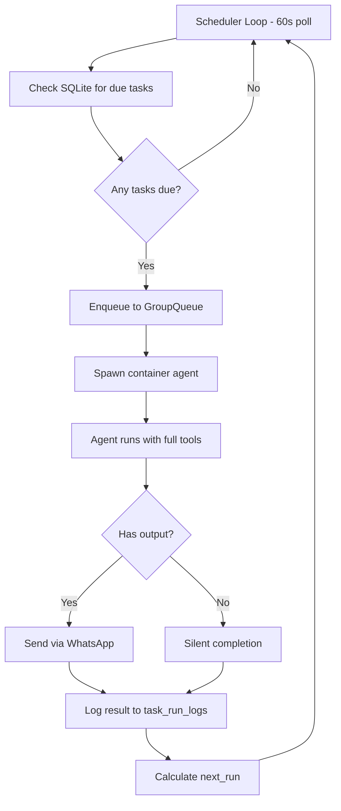
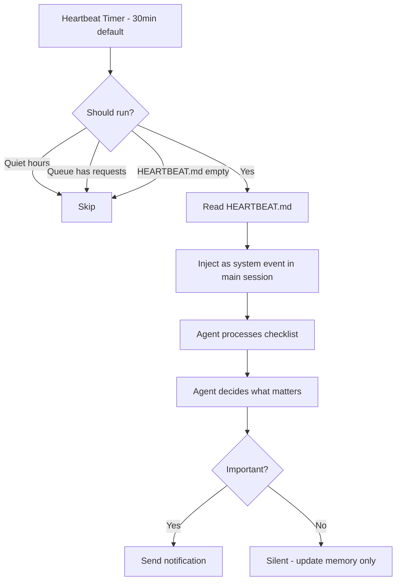

# 02: Heartbeat / Scheduled Jobs

## Overview

The heartbeat is what makes an AI agent **proactive** instead of reactive. Without it, the agent only responds when spoken to. With it, the agent checks emails, scans calendars, prepares meeting notes, and nudges you about deadlines — all on its own.

**Why it matters:** This is the single biggest "wow factor" for users. Getting a WhatsApp message at 8:55am saying "You have a meeting with Sarah at 9am — here's a summary of your last discussion" is what makes the agent feel like a real assistant.

---

## NanoClaw's Scheduled Tasks (Primary)

### Architecture

NanoClaw has a clean scheduler built directly into the host process. Tasks are stored in SQLite, checked every 60 seconds, and executed as full containerised agents.



### Key Components

#### 1. Task Storage (SQLite)

```typescript
// From src/db.ts
CREATE TABLE IF NOT EXISTS scheduled_tasks (
  id TEXT PRIMARY KEY,
  group_folder TEXT NOT NULL,
  chat_jid TEXT NOT NULL,
  prompt TEXT NOT NULL,
  schedule_type TEXT NOT NULL,      -- 'cron' | 'interval' | 'once'
  schedule_value TEXT NOT NULL,     -- cron expression | ms | ISO timestamp
  context_mode TEXT DEFAULT 'isolated',  -- 'group' | 'isolated'
  next_run TEXT,
  last_run TEXT,
  last_result TEXT,
  status TEXT DEFAULT 'active',     -- 'active' | 'paused' | 'completed'
  created_at TEXT NOT NULL
);
```

#### 2. Scheduler Loop

```typescript
// From src/task-scheduler.ts
export function startSchedulerLoop(deps: SchedulerDependencies): void {
  const loop = async () => {
    const dueTasks = getDueTasks();  // SELECT * WHERE status='active' AND next_run <= now

    for (const task of dueTasks) {
      const currentTask = getTaskById(task.id);  // Re-check in case paused
      if (!currentTask || currentTask.status !== 'active') continue;

      deps.queue.enqueueTask(
        currentTask.chat_jid,
        currentTask.id,
        () => runTask(currentTask, deps),
      );
    }

    setTimeout(loop, SCHEDULER_POLL_INTERVAL);  // 60000ms = 1 minute
  };
  loop();
}
```

**Key design choice:** Tasks go through the `GroupQueue` with concurrency limits (max 5 containers). This prevents a burst of scheduled tasks from overwhelming the system.

#### 3. Task Execution

Tasks run as **full containerised agents** with access to all tools:

```typescript
// From src/task-scheduler.ts - runTask()
const output = await runContainerAgent(
  group,
  {
    prompt: task.prompt,
    sessionId,                    // Can resume group session for context
    groupFolder: task.group_folder,
    chatJid: task.chat_jid,
    isMain,
    isScheduledTask: true,        // Adds [SCHEDULED TASK] prefix to prompt
  },
  // ...
);
```

The `isScheduledTask` flag tells the agent runner to prefix the prompt:

```typescript
// From container/agent-runner/src/index.ts
if (containerInput.isScheduledTask) {
  prompt = `[SCHEDULED TASK - The following message was sent automatically 
             and is not coming directly from the user or group.]\n\n${prompt}`;
}
```

#### 4. Context Mode (Group vs Isolated)

This is a clever design choice that affects how tasks perceive history:

| Mode | Session | Use Case |
|------|---------|----------|
| `group` | Resumes group's session | "Follow up on our discussion" — needs conversation context |
| `isolated` | Fresh session, no history | "Check the weather" — self-contained, doesn't need context |

```typescript
// From src/task-scheduler.ts
const sessionId =
  task.context_mode === 'group' ? sessions[task.group_folder] : undefined;
```

#### 5. Schedule Types

| Type | Value Format | Example | Re-scheduling |
|------|-------------|---------|---------------|
| `cron` | Cron expression | `0 9 * * 1-5` (weekdays 9am) | Next cron occurrence |
| `interval` | Milliseconds | `1800000` (30 min) | `now + interval` |
| `once` | ISO timestamp | `2026-02-15T17:00:00` | None (marks completed) |

```typescript
// From src/task-scheduler.ts - next run calculation
if (task.schedule_type === 'cron') {
  const interval = CronExpressionParser.parse(task.schedule_value, { tz: TIMEZONE });
  nextRun = interval.next().toISOString();
} else if (task.schedule_type === 'interval') {
  const ms = parseInt(task.schedule_value, 10);
  nextRun = new Date(Date.now() + ms).toISOString();
}
// 'once' tasks have no next run → status becomes 'completed'
```

#### 6. MCP Tools for Task Management

The agent manages its own schedule via MCP tools — no admin UI needed:

```typescript
// From container/agent-runner/src/ipc-mcp-stdio.ts
server.tool('schedule_task', '...', { /* schema */ }, async (args) => { /* ... */ });
server.tool('list_tasks', '...', {}, async () => { /* ... */ });
server.tool('pause_task', '...', { task_id }, async (args) => { /* ... */ });
server.tool('resume_task', '...', { task_id }, async (args) => { /* ... */ });
server.tool('cancel_task', '...', { task_id }, async (args) => { /* ... */ });
```

**This means the agent can schedule itself.** You say "remind me every Monday at 9am" and the agent calls `schedule_task` with a cron expression. No manual configuration needed.

#### 7. Idle Timeout Pattern

After a task completes, the container stays alive for 30 minutes (IDLE_TIMEOUT) to handle follow-up messages. Then it's gracefully shut down via a `_close` sentinel file:

```typescript
// From src/task-scheduler.ts
const resetIdleTimer = () => {
  if (idleTimer) clearTimeout(idleTimer);
  idleTimer = setTimeout(() => {
    deps.queue.closeStdin(task.chat_jid);  // Write _close sentinel
  }, IDLE_TIMEOUT);
};
```

---

## OpenClaw's Heartbeat (Reference)

### Architecture

OpenClaw's heartbeat is fundamentally different — it's a **periodic agent turn** in the main session, not a standalone scheduler.



### Key Differences from NanoClaw

| Aspect | NanoClaw | OpenClaw |
|--------|----------|----------|
| **Execution model** | Independent container per task | Turn in main session |
| **Context** | Fresh or resumed session | Always has full main session context |
| **Scheduling** | Per-task cron/interval/once | Single heartbeat interval |
| **Task creation** | Agent creates via MCP tool | User configures HEARTBEAT.md |
| **Importance judging** | Task prompt decides what to report | Agent reads checklist, decides |
| **Output** | Always sends result (or stays silent by prompt design) | Agent decides if notification worthy |

### HEARTBEAT.md Pattern

OpenClaw's heartbeat reads a `HEARTBEAT.md` file that acts as a checklist:

```markdown
# Heartbeat Checklist

## Every Check
- Check email for urgent messages
- Review calendar for upcoming meetings (next 2 hours)
- Check if any task deadlines are approaching

## Morning (before 10am)
- Summarise overnight emails
- Preview today's calendar

## Evening (after 5pm)
- Review tomorrow's schedule
- Flag anything that needs prep
```

The agent reads this, does the work, then **judges** what's worth reporting. This is the "importance judging" that prevents alert fatigue.

### Smart Scheduling Features

OpenClaw has additional sophistication:

- **Quiet hours** — no heartbeats during sleep time
- **Backoff** — skips when request queue is busy
- **Reasoning mode** — can include reasoning in heartbeat output for debugging
- **Cron jobs** — separate system for precise scheduled tasks (more like NanoClaw's approach)

---

## Key Insights

1. **NanoClaw's approach is more flexible.** Each task is independent — different schedules, different contexts, different prompts. OpenClaw's heartbeat is one big checklist.

2. **OpenClaw's "importance judging" is crucial for avoiding alert fatigue.** The agent checks everything but only notifies about what matters. NanoClaw achieves this by letting each task prompt specify "only message if there's something to report."

3. **The `context_mode` split is genius.** "Check the weather" doesn't need conversation history (isolated). "Follow up on our budget discussion" does (group). This saves tokens and keeps tasks fast.

4. **Self-scheduling via MCP is the most natural interface.** Users just talk — "remind me every Friday at 3pm to review my tasks" — and the agent handles the technical details.

5. **The 30-minute heartbeat interval is a sweet spot.** Frequent enough to catch urgent emails, rare enough to not hammer APIs or burn tokens.

---

## Security Considerations

| Risk | Mitigation |
|------|-----------|
| **Runaway tasks** | Max concurrent containers (5), task status checks before execution |
| **Task injection** | Only agents can create tasks via MCP, authorisation checks on IPC |
| **Cross-group scheduling** | Non-main groups can only schedule for themselves |
| **Credential exposure** | Secrets passed via stdin, never written to disk |
| **Token burn** | Each task spawns a container → API call. Monitor usage. |

---

## AAGLOBAL Implementation

### Recommended Approach

Combine both patterns: NanoClaw's task scheduler + OpenClaw's heartbeat checklist.

```
brain/heartbeat/
├── beat.py           # Main heartbeat (30-min cron)
├── HEARTBEAT.md      # Checklist of what to check
├── gmail.py          # Gmail API integration
├── calendar.py       # Calendar API integration
├── reminders.py      # macOS Reminders bridge (already built!)
└── judge.py          # Claude judges importance of findings
```

### How It Works

```python
# brain/heartbeat/beat.py (simplified)
import schedule
import time

def heartbeat():
    """Run every 30 minutes."""
    checklist = read_file('.claude/memory/HEARTBEAT.md')
    
    # Gather data from integrations
    emails = gmail.get_unread(since='30m')
    calendar_events = calendar.get_upcoming(hours=2)
    reminders = reminders.get_due()
    
    # Let Claude judge importance
    prompt = f"""
    You are Troy's personal assistant. Here's what happened in the last 30 minutes:
    
    ## Unread Emails
    {format_emails(emails)}
    
    ## Upcoming Calendar
    {format_events(calendar_events)}
    
    ## Due Reminders  
    {format_reminders(reminders)}
    
    ## Your Checklist
    {checklist}
    
    Decide what's worth notifying Troy about. Only message him if something 
    is genuinely important or time-sensitive. If nothing is urgent, stay silent.
    """
    
    response = claude.ask(prompt)
    
    if response.should_notify:
        whatsapp.send(response.message)

# Run every 30 minutes
schedule.every(30).minutes.do(heartbeat)
```

### Priority: What to Check

| Integration | Priority | Complexity | Already Built? |
|-------------|----------|-----------|---------------|
| macOS Reminders | High | Simple | Yes! |
| Calendar (Google) | High | Medium | No |
| Gmail | High | Medium | No |
| Task deadlines | Medium | Simple | Partial |
| WhatsApp groups | Low | Complex | No |

### Estimated Complexity

**Basic heartbeat (cron + importance judging):** Medium — 1-2 days.

**Gmail/Calendar integration:** Medium — 1 day each (mostly OAuth setup).

**Smart importance judging:** Simple once the data gathering is done — Claude handles the judgement naturally.
