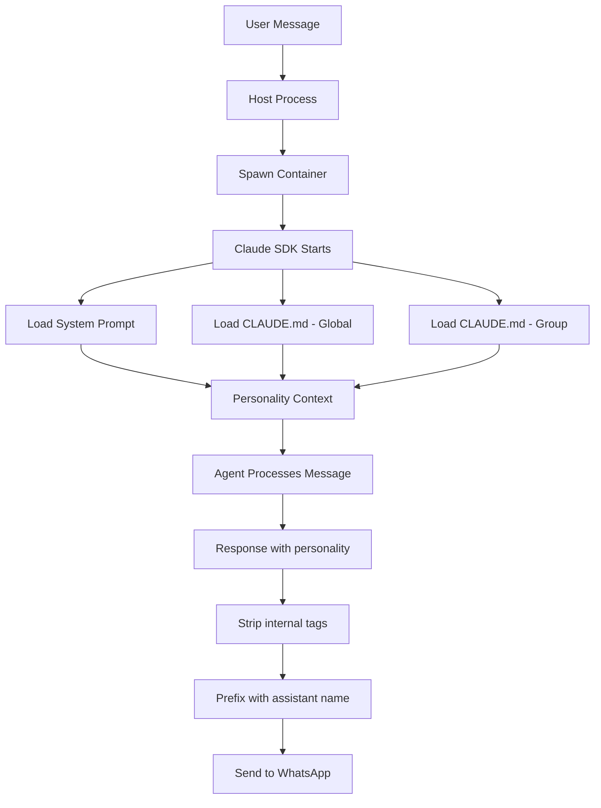
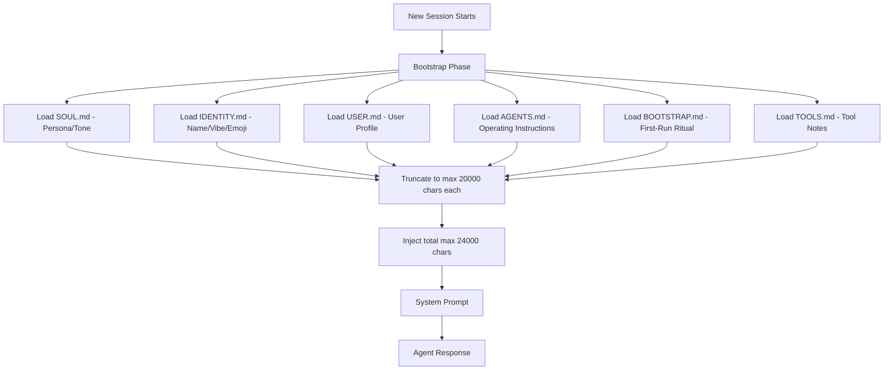

# 03: Personality / Human Feel Injection

## Overview

Personality injection is what transforms a generic AI assistant into **your** assistant. Without it, responses are polished but impersonal — like talking to a call centre. With it, the agent has a consistent voice, remembers your quirks, and feels like texting a friend who happens to be extremely capable.

**Why it matters:** This is the "uncanny valley" problem in reverse. The closer to human the agent feels, the more trust and engagement it gets. Get it right, and people forget they're talking to software.

---

## NanoClaw's Personality System (Primary)

### Architecture

NanoClaw injects personality through a simple but effective pipeline:



### Key Components

#### 1. The CLAUDE.md Identity File

The main personality injection happens in `groups/main/CLAUDE.md`:

```markdown
# Andy

You are Andy, a personal assistant. You help with tasks, answer questions, 
and can schedule reminders.

## What You Can Do
- Answer questions and have conversations
- Search the web and fetch content from URLs
- Browse the web with agent-browser
- Read and write files in your workspace
- Run bash commands in your sandbox
- Schedule tasks to run later or on a recurring basis
- Send messages back to the chat
```

**This is the entire personality definition.** It's minimal by design — the personality emerges from the constraints rather than from elaborate prompting.

#### 2. Communication Style Rules

NanoClaw enforces WhatsApp-native formatting:

```markdown
## WhatsApp Formatting (and other messaging apps)

Do NOT use markdown headings (##) in WhatsApp messages. Only use:
- *Bold* (single asterisks) (NEVER **double asterisks**)
- _Italic_ (underscores)
- • Bullets (bullet points)
- ```Code blocks``` (triple backticks)

Keep messages clean and readable for WhatsApp.
```

**Why this matters enormously:** Nothing breaks the illusion of "human feel" faster than a WhatsApp message with `##` headers and `[markdown links](url)`. Forcing WhatsApp-native formatting makes responses feel like they were typed by a person.

#### 3. Internal Thoughts Pattern

```markdown
### Internal thoughts

If part of your output is internal reasoning rather than something for the user, 
wrap it in `<internal>` tags:

<internal>Compiled all three reports, ready to summarize.</internal>

Here are the key findings from the research...
```

The host process strips `<internal>` tags before sending:

```typescript
// From src/router.ts
export function stripInternalTags(text: string): string {
  return text.replace(/<internal>[\s\S]*?<\/internal>/g, '').trim();
}
```

**Key insight:** This lets the agent "think out loud" without the user seeing the internal reasoning. It makes responses feel more confident and direct — the user sees conclusions, not deliberation.

#### 4. Immediate Acknowledgement Pattern

```markdown
You also have `mcp__nanoclaw__send_message` which sends a message immediately 
while you're still working. This is useful when you want to acknowledge a 
request before starting longer work.
```

**Why this is a human-feel secret:** Humans say "on it!" before starting long tasks. This pattern enables the same behaviour — the agent can acknowledge instantly, then deliver the full result later. Without this, there's an uncomfortable silence while the agent works.

#### 5. Group-Specific Personality

Each group can have its own personality flavour via its `CLAUDE.md`. A "Work Team" group might have:

```markdown
# Andy (Work Context)
Keep responses professional and concise. Focus on action items.
```

While a "Family Chat" group might have:

```markdown
# Andy (Family)
Be warm and casual. Use emojis occasionally. 
Remember family members' names and preferences.
```

#### 6. Global vs Local Memory

The hierarchical memory system reinforces personality consistency:

```typescript
// From container/agent-runner/src/index.ts
// Global CLAUDE.md injected via systemPrompt.append for non-main groups
const globalClaudeMdPath = '/workspace/global/CLAUDE.md';
let globalClaudeMd: string | undefined;
if (!containerInput.isMain && fs.existsSync(globalClaudeMdPath)) {
  globalClaudeMd = fs.readFileSync(globalClaudeMdPath, 'utf-8');
}
```

Global personality traits (like "always use Australian English") persist across all groups, while group-specific traits layer on top.

---

## OpenClaw's Personality System (Reference)

### Architecture

OpenClaw has a much more elaborate personality injection system with multiple dedicated files:



### Key Files

| File | Purpose | Example Content |
|------|---------|----------------|
| `SOUL.md` | Core persona, tone, boundaries | "You are warm but direct. Avoid corporate jargon. Match the user's energy." |
| `IDENTITY.md` | Name, vibe, emoji | "Name: Pi, Vibe: thoughtful-friend, Emoji: 🌀" |
| `USER.md` | User profile and preferences | "Troy prefers bullet points, works in tech, ADHD-friendly responses" |
| `AGENTS.md` | Operating instructions | "Check email before responding to morning messages" |
| `BOOTSTRAP.md` | First-run greeting ritual | "On first message, introduce yourself and ask about preferences" |
| `TOOLS.md` | User-maintained tool notes | "Gmail: use the summary view, not full thread" |

### System Prompt Injection

```
"If SOUL.md is present, embody its persona and tone. Avoid stiff, generic replies; 
follow its guidance unless higher-priority instructions override it."
```

### SOUL.md Template

```markdown
# SOUL

## Persona
You are [name], a personal assistant who feels like a trusted friend.

## Voice
- Warm but not sycophantic
- Direct but not curt  
- Knowledgeable but humble
- Proactive but not pushy

## Boundaries
- Never pretend to have feelings you don't have
- Be honest about uncertainty
- Don't over-promise on capabilities

## Tone
- Match the user's energy level
- Use Australian English (colour, organise, behaviour)
- Keep responses ADHD-friendly (short paragraphs, bullet points)
- Avoid corporate speak
```

### Bootstrap Injection (First Turn Only)

On the first turn of a new session, OpenClaw injects workspace files as context:

- Files are **trimmed** to max 20,000 chars each
- Total injection capped at ~24,000 chars
- Only injected once per session (not every turn)

This is important for token efficiency — you don't want SOUL.md consuming context on every message.

---

## Key Insights

1. **Less is more.** NanoClaw's personality definition is ~20 lines. OpenClaw's is spread across 6 files. Both work, but NanoClaw's simplicity means the personality never contradicts itself.

2. **Format enforcement is the #1 human-feel hack.** Forcing WhatsApp-native formatting (`*bold*` not `**bold**`, no `##` headers) instantly makes responses feel 10x more human. This is low-effort, high-impact.

3. **The `<internal>` tag pattern is brilliant.** Humans don't show their working by default. Neither should the agent. Internal reasoning gets stripped, so the user only sees polished conclusions.

4. **Immediate acknowledgement (`send_message`)** mimics human behaviour. "Working on it!" before a long task prevents the user from wondering if the message was received.

5. **SOUL.md separation is valuable.** Keeping personality separate from operating instructions means you can tweak tone without touching functionality. NanoClaw mixes them into one CLAUDE.md — OpenClaw's separation is better for maintenance.

6. **Token budget matters.** OpenClaw caps personality injection at 24,000 chars total. Without limits, personality files eat into the context window and degrade response quality.

---

## Security Considerations

| Risk | Mitigation |
|------|-----------|
| **Personality manipulation** | Non-main groups can only modify their own CLAUDE.md |
| **Prompt injection via group CLAUDE.md** | Group members could add malicious instructions to CLAUDE.md |
| **Identity spoofing** | Agent always prefixes responses with its name |
| **Excessive personality** | Cap personality files to prevent context window hogging |

---

## AAGLOBAL Implementation

### Recommended Approach

Use OpenClaw's file separation with NanoClaw's simplicity:

```
.claude/memory/
├── SOUL.md           # Persona, tone, voice (based on OpenClaw's SOUL.md)
├── USER.md           # Troy's preferences and context
├── MEMORY.md         # Long-term facts and learnings
├── HEARTBEAT.md      # What to check proactively
└── AGENTS.md         # Operating instructions
```

### SOUL.md for AAGLOBAL

```markdown
# SOUL

## Persona
You are AAGLOBAL-Brain, Troy's personal assistant. You feel like a competent 
friend who happens to have access to his email, calendar, and tasks.

## Voice
- Australian English (colour, organise, behaviour)
- Direct and concise — Troy has ADHD, keep it scannable
- Warm but professional
- Proactive — offer help before being asked
- Honest about limitations

## Communication
- Use bullet points, not paragraphs
- Bold key info with *single asterisks*
- No markdown headers in messages
- No corporate jargon
- Emoji sparingly (if at all)

## Boundaries
- Never fabricate information
- Say "I'm not sure" when uncertain
- Don't over-notify — only message for genuinely important things
- Respect quiet hours (10pm - 7am)
```

### Key Implementation Details

1. **Format enforcement**: Add to system prompt — "NEVER use markdown in WhatsApp messages. Only use WhatsApp-native formatting."

2. **Internal reasoning**: Implement `<internal>` tag stripping in output processing.

3. **Immediate acknowledgement**: Use `send_message` MCP tool for long-running tasks.

4. **Personality loading**: Load SOUL.md once per session start, not every message (save tokens).

5. **Token budget**: Cap total personality context at 5,000 tokens (~20,000 chars).

### Estimated Complexity

**Creating SOUL.md + USER.md:** Simple — 30 minutes of writing.

**Format enforcement in output pipeline:** Simple — regex strip + format rules. 1 hour.

**Internal reasoning tags:** Simple — already shown in NanoClaw. 30 minutes.

**Personality loading with token budgeting:** Medium — need to implement truncation and injection. 2-3 hours.
