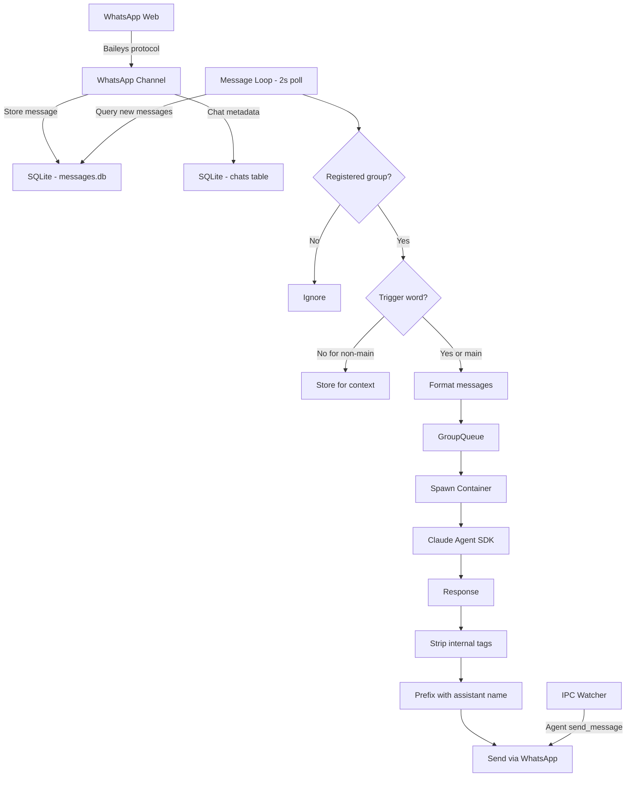
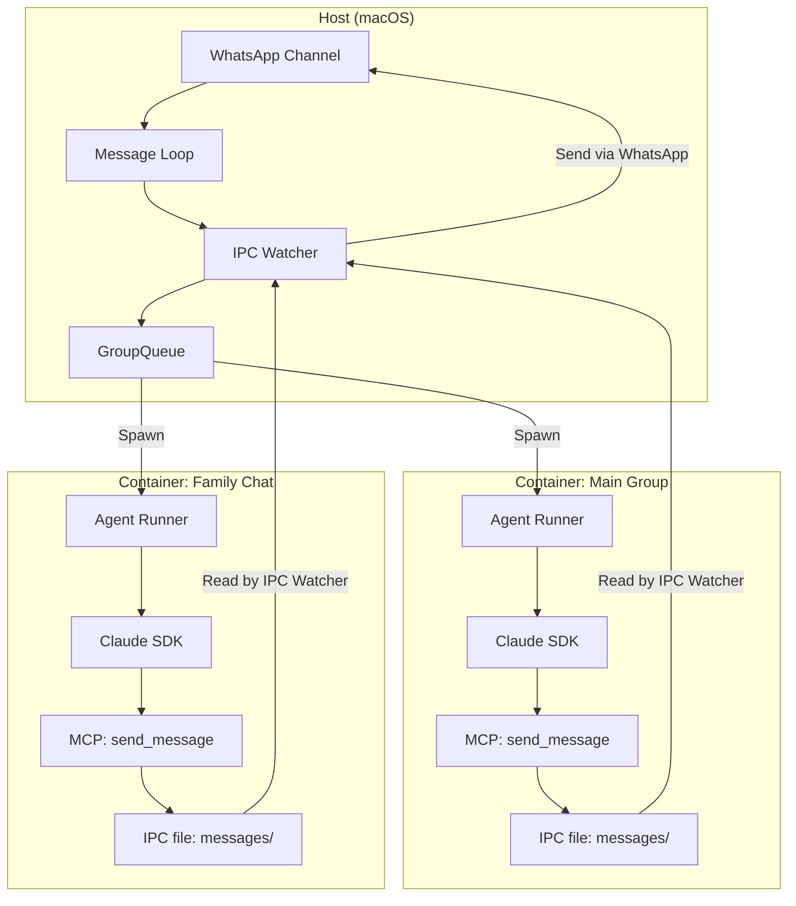

# 04: WhatsApp Adapter

## Overview

The WhatsApp adapter is how the AI agent talks to you on your phone. Both NanoClaw and OpenClaw use the same underlying library (Baileys) but architect the integration very differently.

**Why it matters:** WhatsApp is Troy's primary communication channel. Getting this right means the agent is always accessible — in your pocket, on your wrist, in your car.

---

## NanoClaw's WhatsApp Integration (Primary)

### Architecture

NanoClaw treats WhatsApp as the **only** channel. The entire system is built around it.



### Key Components

#### 1. Baileys Connection

```typescript
// From src/channels/whatsapp.ts
import makeWASocket, {
  Browsers,
  DisconnectReason,
  makeCacheableSignalKeyStore,
  useMultiFileAuthState,
} from '@whiskeysockets/baileys';

this.sock = makeWASocket({
  auth: {
    creds: state.creds,
    keys: makeCacheableSignalKeyStore(state.keys, logger),
  },
  printQRInTerminal: false,
  logger,
  browser: Browsers.macOS('Chrome'),
});
```

**What this does:**
- Connects to WhatsApp Web protocol (reverse-engineered)
- Authenticates using stored credentials (QR code scan once)
- Presents itself as Chrome on macOS to WhatsApp servers
- Persists auth state in `store/auth/` directory

**Critical detail:** This is the **unofficial** WhatsApp Web protocol. It works but could break if WhatsApp changes their protocol. This is very different from the official WhatsApp Business API.

#### 2. Message Handling

```typescript
// From src/channels/whatsapp.ts
this.sock.ev.on('messages.upsert', async ({ messages }) => {
  for (const msg of messages) {
    if (!msg.message) continue;
    const rawJid = msg.key.remoteJid;
    if (!rawJid || rawJid === 'status@broadcast') continue;

    const chatJid = await this.translateJid(rawJid);
    const timestamp = new Date(Number(msg.messageTimestamp) * 1000).toISOString();

    // Always notify about chat metadata for group discovery
    this.opts.onChatMetadata(chatJid, timestamp);

    // Only deliver full message for registered groups
    const groups = this.opts.registeredGroups();
    if (groups[chatJid]) {
      const content =
        msg.message?.conversation ||
        msg.message?.extendedTextMessage?.text ||
        msg.message?.imageMessage?.caption ||
        msg.message?.videoMessage?.caption || '';
      
      this.opts.onMessage(chatJid, {
        id: msg.key.id || '',
        chat_jid: chatJid,
        sender: msg.key.participant || msg.key.remoteJid || '',
        sender_name: msg.pushName || sender.split('@')[0],
        content,
        timestamp,
        is_from_me: msg.key.fromMe || false,
      });
    }
  }
});
```

**Key design choices:**

1. **Two-tier message handling**: ALL messages update chat metadata (for group discovery). Only registered group messages get content stored. This means unregistered groups' message content is never saved.

2. **Text extraction**: Supports `conversation` (plain text), `extendedTextMessage` (quoted replies), and image/video captions. No support for voice notes, stickers, or documents (yet).

3. **LID translation**: WhatsApp uses both phone-based JIDs (`phone@s.whatsapp.net`) and LID-based JIDs (`lid@lid`). NanoClaw translates between them.

#### 3. Connection Management

```typescript
// From src/channels/whatsapp.ts
if (connection === 'close') {
  this.connected = false;
  const reason = (lastDisconnect?.error as any)?.output?.statusCode;
  const shouldReconnect = reason !== DisconnectReason.loggedOut;

  if (shouldReconnect) {
    this.connectInternal().catch((err) => {
      setTimeout(() => this.connectInternal(), 5000);  // Retry after 5s
    });
  } else {
    process.exit(0);  // Logged out — need manual re-auth
  }
}
```

**Reconnection strategy:**
- Auto-reconnects on temporary disconnects (network issues, server restarts)
- Retries after 5 seconds on reconnection failure
- Exits cleanly if logged out (requires QR re-scan)
- Queues outgoing messages while disconnected, flushes on reconnect

#### 4. Typing Indicators

```typescript
// From src/channels/whatsapp.ts
async setTyping(jid: string, isTyping: boolean): Promise<void> {
  const status = isTyping ? 'composing' : 'paused';
  await this.sock.sendPresenceUpdate(status, jid);
}
```

Used in the message processing pipeline:

```typescript
// From src/index.ts
await whatsapp.setTyping(chatJid, true);   // Show "typing..."
const output = await runAgent(/* ... */);
await whatsapp.setTyping(chatJid, false);  // Stop "typing..."
```

**Human-feel detail:** Showing "typing..." while the agent processes makes it feel like someone is actually composing a response. Without this, there's just silence until the response appears.

#### 5. Group Metadata Sync

```typescript
// From src/channels/whatsapp.ts
async syncGroupMetadata(force = false): Promise<void> {
  // Respects 24-hour cache
  const groups = await this.sock.groupFetchAllParticipating();
  for (const [jid, metadata] of Object.entries(groups)) {
    if (metadata.subject) {
      updateChatName(jid, metadata.subject);
    }
  }
  setLastGroupSync();
}
```

Runs on startup and daily. Populates the `chats` table so the agent can discover and register new groups.

#### 6. Outgoing Message Queue

```typescript
// From src/channels/whatsapp.ts
async sendMessage(jid: string, text: string): Promise<void> {
  if (!this.connected) {
    this.outgoingQueue.push({ jid, text });
    return;
  }
  try {
    await this.sock.sendMessage(jid, { text });
  } catch (err) {
    this.outgoingQueue.push({ jid, text });  // Queue on failure
  }
}
```

**Resilience pattern:** Messages are never lost. If WhatsApp is disconnected, they queue up and send when reconnected.

---

## Container Isolation Architecture

This is NanoClaw's killer security feature for WhatsApp:



**Key security boundary:** Containers can't directly send WhatsApp messages. They write IPC files, and the host process validates them before sending. This means:

- A compromised Family Chat agent can't send messages to Work Team
- Non-main containers can only message their own group
- Main container can message any group

```typescript
// From src/ipc.ts
// Authorization: verify this group can send to this chatJid
const targetGroup = registeredGroups[data.chatJid];
if (isMain || (targetGroup && targetGroup.folder === sourceGroup)) {
  await deps.sendMessage(data.chatJid, `${ASSISTANT_NAME}: ${data.text}`);
} else {
  logger.warn('Unauthorized IPC message attempt blocked');
}
```

---

## OpenClaw's WhatsApp Integration (Reference)

OpenClaw's WhatsApp is an **extension** (plugin), not a core channel. It also uses Baileys but with a much more abstracted architecture.

### Key Differences

| Aspect | NanoClaw | OpenClaw |
|--------|----------|----------|
| **Integration level** | Core, only channel | Extension plugin, one of 15+ |
| **Protocol** | Baileys (unofficial) | Baileys (unofficial) |
| **Architecture** | Direct: WhatsApp → SQLite → Agent | Gateway: WhatsApp → Channel Plugin → Gateway WS → Agent |
| **State management** | Single process | Gateway control plane |
| **Multi-channel** | WhatsApp only | Any combination of channels |
| **Security** | Container isolation | Application-level allowlists + DM pairing |
| **Hosting** | Local macOS service | Can run anywhere |

### Channel Plugin Interface

OpenClaw abstracts all channels through a common interface:

```typescript
interface ChannelPlugin {
  config: ConfigAdapter;       // Configuration resolution
  pairing: PairingAdapter;     // DM pairing/allowlist
  security: SecurityAdapter;   // Security policies
  outbound: OutboundAdapter;   // Message sending
  status: StatusAdapter;       // Health checks
  messaging: MessagingAdapter; // Message normalisation
  gateway: GatewayAdapter;     // Gateway WebSocket methods
}
```

This is overkill for a single-user assistant but makes sense for a multi-user platform.

---

## Honest Assessment: WhatsApp API Options

### Option A: Baileys (Unofficial — What NanoClaw Uses)

**Pros:**
- Free
- Works immediately (QR scan)
- Full access to groups, personal chats
- No Meta Business account needed
- Runs locally

**Cons:**
- Can break when WhatsApp updates their protocol
- Technically against WhatsApp's ToS
- Session expires every ~20 days (need re-scan)
- No official support

### Option B: WhatsApp Business API (Official)

**Pros:**
- Officially supported
- Stable, won't break
- Supports rich messages (buttons, lists)

**Cons:**
- Requires Meta Business account (verified)
- Requires public webhook URL (can't be local-only)
- Costs money per conversation
- Complex setup
- Contradicts "no middleware" principle

### Option C: NanoClaw's Approach (Recommended for AAGLOBAL)

Fork NanoClaw's Baileys setup. It's battle-tested, runs locally, and is free. The ToS risk is real but low for personal use.

---

## Security Considerations

| Risk | NanoClaw's Mitigation | AAGLOBAL Should |
|------|----------------------|-----------------|
| **Message interception** | Messages in transit use WhatsApp's E2E encryption | Same (Baileys inherits this) |
| **Auth credential theft** | `store/auth/` never mounted in containers | Keep auth state outside of agent access |
| **Cross-group messaging** | IPC authorisation checks in host process | Copy this pattern |
| **Prompt injection** | Container isolation limits blast radius | Container isolation + trigger word |
| **Session expiry** | Auto-reconnect, exit on logout | Auto-reconnect + notification to re-auth |
| **Rate limiting** | GroupQueue with max 5 concurrent | Keep concurrency limits |

---

## AAGLOBAL Implementation

### Recommended Approach

Use NanoClaw's WhatsApp adapter as the starting point. It's clean, well-tested, and handles edge cases (reconnection, message queuing, LID translation).

### What to Copy Directly

1. **Baileys setup** — `makeWASocket` configuration with `Browsers.macOS('Chrome')`
2. **Auth persistence** — `useMultiFileAuthState` in a gitignored directory
3. **Reconnection logic** — auto-reconnect with retry backoff
4. **Message queue** — queue outgoing messages while disconnected
5. **Typing indicators** — `sendPresenceUpdate('composing')`
6. **Group metadata sync** — daily sync of group names and JIDs

### What to Adapt

1. **Message routing** — AAGLOBAL may not need the full trigger-word system initially
2. **IPC pattern** — adapt to AAGLOBAL's architecture (may use Python instead of Node)
3. **Container isolation** — decide if AAGLOBAL agents need the same level of isolation

### Architecture for AAGLOBAL

```
brain/adapters/whatsapp/
├── client.py          # Baileys connection (via Node subprocess or Python port)
├── webhook.py         # Message handling and routing
├── auth/              # Auth state (gitignored)
└── queue.py           # Outgoing message queue
```

**Important decision:** Baileys is Node.js. If AAGLOBAL's brain is Python, you have two options:
1. Run NanoClaw's Node process alongside Python (recommended — don't rewrite Baileys)
2. Use a Python WhatsApp library (less mature, more risk)

### Estimated Complexity

**Basic WhatsApp connection (send/receive):** Medium — 1-2 days. Mostly setup and testing.

**Trigger word + group routing:** Simple — 2-3 hours.

**Container isolation for agents:** Complex — 2-3 days. Only needed if running untrusted group agents.

**Typing indicators + message queue:** Simple — 1 hour. Direct port from NanoClaw.
