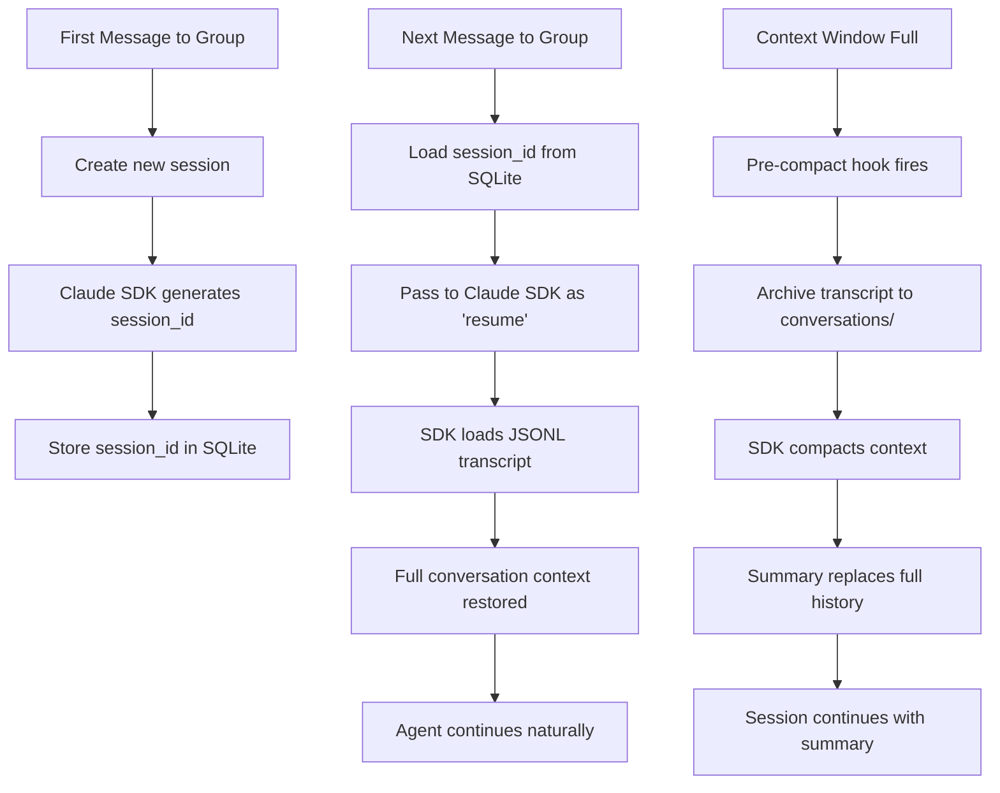
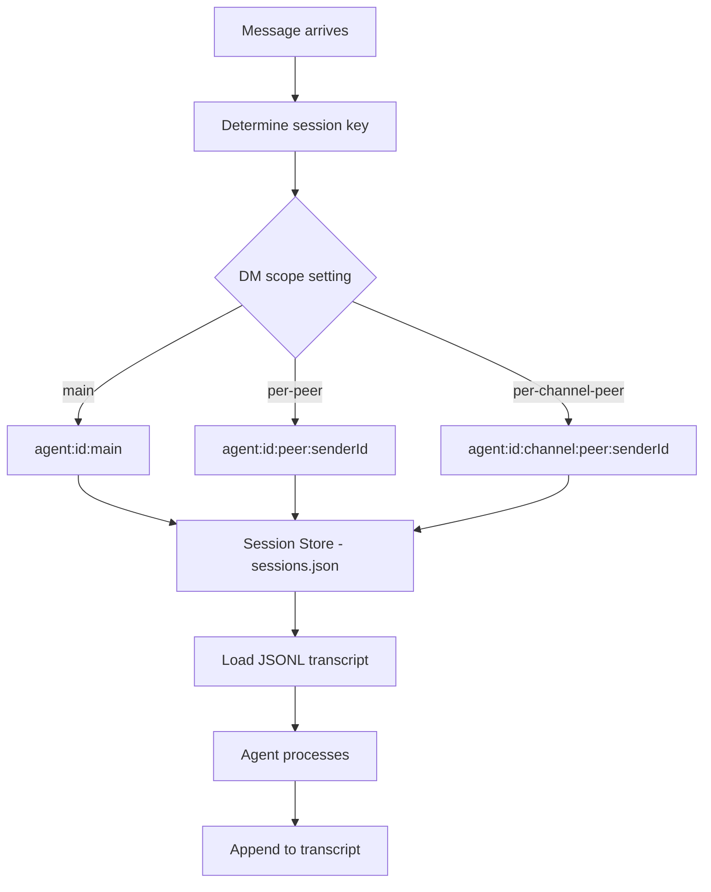

# 05: Session Continuity

## Overview

Session continuity is how the agent **remembers what you just talked about**. Without it, every message starts a fresh conversation — the agent wouldn't know you just asked about pizza toppings 30 seconds ago. With it, conversations flow naturally across hours, days, and context resets.

**Why it matters:** This is table stakes for feeling human. If you have to repeat yourself every message, the agent feels broken, not intelligent.

---

## NanoClaw's Session System (Primary)

### Architecture

NanoClaw uses the Claude Agent SDK's built-in session management. Sessions are JSONL transcript files stored on the host and mounted into containers.



### Key Components

#### 1. Session Storage

Sessions are tracked per group folder in SQLite:

```typescript
// From src/db.ts
CREATE TABLE IF NOT EXISTS sessions (
  group_folder TEXT PRIMARY KEY,
  session_id TEXT NOT NULL
);
```

When the agent runs and returns a new session ID, it's stored immediately:

```typescript
// From src/index.ts
const wrappedOnOutput = onOutput
  ? async (output: ContainerOutput) => {
      if (output.newSessionId) {
        sessions[group.folder] = output.newSessionId;
        setSession(group.folder, output.newSessionId);
      }
      await onOutput(output);
    }
  : undefined;
```

#### 2. Session Resume

Each time a container spawns for a group, the existing session ID is passed:

```typescript
// From src/index.ts - runAgent()
const sessionId = sessions[group.folder];

const output = await runContainerAgent(
  group,
  {
    prompt,
    sessionId,        // <-- Previous session ID passed here
    groupFolder: group.folder,
    chatJid,
    isMain,
  },
  // ...
);
```

Inside the container, this gets passed to the Claude SDK:

```typescript
// From container/agent-runner/src/index.ts
for await (const message of query({
  prompt: stream,
  options: {
    cwd: '/workspace/group',
    resume: sessionId,           // <-- Resume previous session
    resumeSessionAt: resumeAt,   // <-- Resume at specific message
    // ...
  }
})) { /* ... */ }
```

#### 3. Per-Group Session Isolation

Each group gets its own `.claude/` directory for session data, mounted at `/home/node/.claude/` inside the container:

```typescript
// From src/container-runner.ts
const groupSessionsDir = path.join(DATA_DIR, 'sessions', group.folder, '.claude');
fs.mkdirSync(groupSessionsDir, { recursive: true });

mounts.push({
  hostPath: groupSessionsDir,
  containerPath: '/home/node/.claude',
  readonly: false,
});
```

**Security implication:** Groups can't see each other's conversation history. Each container only has its own session data mounted.

#### 4. Conversation Catch-Up (Context Accumulation)

Between agent invocations, messages accumulate in SQLite. When the agent is triggered, all messages since the last interaction are formatted and sent:

```typescript
// From src/index.ts - processGroupMessages()
const sinceTimestamp = lastAgentTimestamp[chatJid] || '';
const missedMessages = getMessagesSince(chatJid, sinceTimestamp, ASSISTANT_NAME);

if (missedMessages.length === 0) return true;

const prompt = formatMessages(missedMessages);
```

The messages are formatted as XML for structured parsing:

```typescript
// From src/router.ts
export function formatMessages(messages: NewMessage[]): string {
  const lines = messages.map((m) =>
    `<message sender="${escapeXml(m.sender_name)}" time="${m.timestamp}">${escapeXml(m.content)}</message>`,
  );
  return `<messages>\n${lines.join('\n')}\n</messages>`;
}
```

**Result:** The agent sees something like:

```xml
<messages>
<message sender="Troy" time="2026-02-15T14:30:00Z">hey, what was that restaurant we talked about?</message>
<message sender="Sarah" time="2026-02-15T14:31:00Z">oh the Italian place?</message>
<message sender="Troy" time="2026-02-15T14:32:00Z">@Andy yeah, what was it called?</message>
</messages>
```

This gives the agent full conversation context even for messages sent while the container was inactive.

#### 5. Multi-Turn Within a Container

NanoClaw keeps containers alive for 30 minutes (idle timeout). During that time, new messages are piped directly into the active session via IPC:

```typescript
// From src/index.ts - startMessageLoop()
if (queue.sendMessage(chatJid, formatted)) {
  // Piped message to active container
  lastAgentTimestamp[chatJid] = messagesToSend[messagesToSend.length - 1].timestamp;
  saveState();
  whatsapp.setTyping(chatJid, true);
} else {
  // No active container — enqueue for a new one
  queue.enqueueMessageCheck(chatJid);
}
```

Inside the container, the agent runner polls for piped messages:

```typescript
// From container/agent-runner/src/index.ts
// Query loop: run query → wait for IPC message → run new query → repeat
while (true) {
  const queryResult = await runQuery(prompt, sessionId, /* ... */);
  
  // Wait for the next message or _close sentinel
  const nextMessage = await waitForIpcMessage();
  if (nextMessage === null) break;  // Container closing
  
  prompt = nextMessage;  // Continue with new message
}
```

**This is critical for natural conversation flow.** Without it, each message would spawn a new container, losing the "in-conversation" feel.

#### 6. Pre-Compact Archiving (Long-Term Continuity)

When the context window fills, Claude compacts it. Before this happens, NanoClaw archives the full transcript:

```typescript
// From container/agent-runner/src/index.ts
function createPreCompactHook(): HookCallback {
  return async (input) => {
    const transcriptPath = preCompact.transcript_path;
    const content = fs.readFileSync(transcriptPath, 'utf-8');
    const messages = parseTranscript(content);
    
    const summary = getSessionSummary(sessionId, transcriptPath);
    const name = summary ? sanitizeFilename(summary) : generateFallbackName();
    
    const conversationsDir = '/workspace/group/conversations';
    const filename = `${date}-${name}.md`;
    const markdown = formatTranscriptMarkdown(messages, summary);
    fs.writeFileSync(filePath, markdown);
  };
}
```

**Saved as:** `groups/{name}/conversations/2026-02-15-topic-summary.md`

**Format:**

```markdown
# Topic Summary

Archived: Feb 15, 2:30 PM

---

**User**: hey, what toppings should we get?
**Andy**: Based on your preferences, I'd suggest margherita...
```

The agent can later search these archives using `Glob` and `Grep` tools to recall old conversations.

#### 7. Crash Recovery

NanoClaw handles crash recovery for unprocessed messages:

```typescript
// From src/index.ts
function recoverPendingMessages(): void {
  for (const [chatJid, group] of Object.entries(registeredGroups)) {
    const sinceTimestamp = lastAgentTimestamp[chatJid] || '';
    const pending = getMessagesSince(chatJid, sinceTimestamp, ASSISTANT_NAME);
    if (pending.length > 0) {
      queue.enqueueMessageCheck(chatJid);
    }
  }
}
```

If the process crashes between receiving a message and processing it, the message is still in SQLite and will be picked up on restart.

---

## OpenClaw's Session System (Reference)

### Architecture

OpenClaw has a more sophisticated session system with multiple layers:



### Session Key Patterns

| Key Pattern | Use Case |
|-------------|----------|
| `agent:<id>:main` | Default — all DMs share one session |
| `agent:<id>:<channel>:group:<groupId>` | Per-group isolation |
| `cron:<jobId>` | Isolated cron job sessions |
| `hook:<uuid>` | Webhook-triggered sessions |
| `agent:<id>:per-peer:<senderId>` | Multi-user: isolate by sender |

### Session Lifecycle

1. **Creation** — new session on first message (or after reset)
2. **Persistence** — JSONL transcript in `sessions/<id>.jsonl`
3. **Compaction** — auto-compact when context fills
4. **Reset** — daily at 4am, or manual `/new`/`/reset`
5. **Expiration** — idle sessions expire after configurable time

### DM Scoping (Multi-User Feature)

OpenClaw supports multiple users talking to the same agent with isolated sessions:

| Scope | Isolation Level | Use Case |
|-------|----------------|----------|
| `main` | None — everyone shares | Single user |
| `per-peer` | By sender ID | Multiple users, shared channels |
| `per-channel-peer` | By channel + sender | Multiple users, multiple channels |

NanoClaw doesn't need this — it's designed for one user.

### Bootstrap Injection

On first turn of a new session, OpenClaw injects workspace files (SOUL.md, USER.md, etc.) into the context. This ensures personality and preferences are loaded even in fresh sessions.

---

## Key Insights

1. **NanoClaw's session = Claude SDK session.** There's almost zero custom code for session management. The SDK handles JSONL storage, resume, and compaction. NanoClaw just stores/retrieves the session ID.

2. **The 30-minute container idle timeout is the secret sauce.** Multi-turn conversations within a single container feel instant. Spawning a new container for each message would add 5-10 seconds of latency and lose the "conversation in progress" feel.

3. **Conversation catch-up via XML formatting** ensures the agent always has context, even for messages sent while the container was inactive. The structured format with sender names and timestamps lets the agent understand who said what and when.

4. **Pre-compact archiving is essential.** Without it, compaction permanently loses conversation details. With it, the agent can always search old conversations via file tools.

5. **OpenClaw's daily session reset is interesting** — it prevents context from growing forever. AAGLOBAL could adopt this as a lightweight "forgetting" strategy.

6. **Crash recovery matters.** Message cursors in SQLite ensure no messages are lost if the process crashes.

---

## Security Considerations

| Risk | Mitigation |
|------|-----------|
| **Cross-group session access** | Per-group `.claude/` directories, container isolation |
| **Session transcript leaks** | Transcripts stored on host, not in containers after exit |
| **Memory overflow** | Context compaction prevents unbounded growth |
| **Replay attacks** | Message IDs prevent duplicate processing |
| **Cursor manipulation** | `lastAgentTimestamp` stored in SQLite, not in container-accessible files |

---

## AAGLOBAL Implementation

### Recommended Approach

Use Claude Code's built-in session management (like NanoClaw) with these additions:

### Phase 1: Basic Session Continuity

```
.claude/memory/
├── sessions/          # Claude Code session transcripts
│   ├── main.jsonl     # Main conversation
│   └── whatsapp.jsonl # WhatsApp conversations
└── conversations/     # Archived transcripts
    ├── 2026-02-15-budget-discussion.md
    └── 2026-02-14-meeting-prep.md
```

### Phase 2: Smart Context Management

```python
# brain/memory/context.py

def get_conversation_context(since: str, max_tokens: int = 4000) -> str:
    """Get recent conversation context, truncated to fit token budget."""
    messages = db.get_messages_since(since)
    
    # Format with sender and timestamp
    formatted = []
    for msg in messages:
        formatted.append(f"[{msg.time}] {msg.sender}: {msg.content}")
    
    # Truncate from oldest if too long
    while count_tokens('\n'.join(formatted)) > max_tokens:
        formatted.pop(0)  # Remove oldest
    
    return '\n'.join(formatted)
```

### Key Decisions for AAGLOBAL

1. **Session scope**: Single user → one main session + per-channel sessions
2. **Idle timeout**: 30 minutes (copy NanoClaw's proven default)
3. **Reset strategy**: Daily at 4am (copy OpenClaw) or manual only
4. **Archiving**: Pre-compact hook to save transcripts as searchable markdown
5. **Crash recovery**: Store message cursor in SQLite, check on startup

### Estimated Complexity

**Basic session resume:** Simple — just pass session ID to Claude. 1 hour.

**Conversation catch-up formatting:** Simple — XML format from NanoClaw. 1 hour.

**Pre-compact archiving:** Medium — need to hook into compaction events. 2-3 hours.

**Multi-turn container keep-alive:** Complex — need IPC for piping messages. 1 day. (Can defer — single-turn still works, just slower.)
