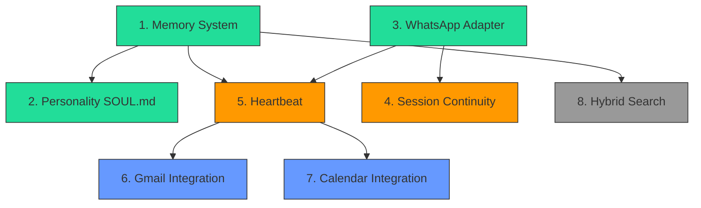

# IMPLEMENTATION PLAN: AAGLOBAL-Brain

> **Goal:** Build a safer, simpler alternative to OpenClaw/NanoClaw with proactive intelligence
>
> **Timeline:** 3-4 weeks (part-time sprints)
>
> **Approach:** NanoClaw patterns first, OpenClaw sophistication where it adds measurable value

---

## Priority Order

Based on the analysis, here's what to build and why — ordered by **impact on user experience** (not technical complexity).

| Priority | Component | Impact | Complexity | Dependencies |
|----------|-----------|--------|-----------|-------------|
| 1 | Memory System (file-based) | Critical | Simple | None |
| 2 | Personality Injection (SOUL.md) | Critical | Simple | Memory |
| 3 | WhatsApp Adapter | Critical | Medium | None |
| 4 | Session Continuity | High | Medium | WhatsApp |
| 5 | Heartbeat / Scheduler | High | Medium | WhatsApp, Memory |
| 6 | Gmail Integration | Medium | Medium | Heartbeat |
| 7 | Calendar Integration | Medium | Medium | Heartbeat |
| 8 | Hybrid Search (vector + FTS5) | Low (initially) | Complex | Memory |

---

## Dependency Graph



**Legend:** Green = Week 1, Orange = Week 2, Blue = Week 3, Grey = Week 4 (if time)

---

## Week 1: Foundation (Memory + Personality + WhatsApp)

### Day 1-2: Memory System + Personality

**Goal:** Create the memory files that define AAGLOBAL-Brain's identity and knowledge base.

**Tasks:**

- [ ] Create `.claude/memory/SOUL.md` — personality, tone, voice, boundaries
- [ ] Create `.claude/memory/USER.md` — Troy's preferences, work context, ADHD-friendly defaults
- [ ] Create `.claude/memory/MEMORY.md` — long-term facts (starts empty, grows over time)
- [ ] Create `.claude/memory/HEARTBEAT.md` — what to check proactively (placeholder for Week 2)
- [ ] Create `.claude/memory/AGENTS.md` — operating instructions for the agent
- [ ] Test: Verify Claude Code loads these files automatically via `CLAUDE.md` discovery

**Key files to create:**

```markdown
# .claude/memory/SOUL.md

## Persona
You are AAGLOBAL-Brain, Troy's personal assistant. You feel like a competent 
friend who happens to have access to his email, calendar, and tasks.

## Voice
- Australian English (colour, organise, behaviour)
- Direct and concise — Troy has ADHD, keep it scannable
- Warm but professional
- Proactive — offer help before being asked
- Honest about limitations

## Communication Rules
- Use bullet points, not paragraphs
- Bold key info with *single asterisks* (WhatsApp format)
- No markdown headers (##) in messages
- No [markdown links](url) — just paste URLs
- Emoji sparingly
- Maximum 3 short paragraphs per response

## Boundaries
- Never fabricate information — say "I'm not sure" when uncertain
- Don't over-notify — only message for genuinely important things
- Respect quiet hours (10pm - 7am)
- Never share information between isolated contexts
```

**Estimated effort:** 2-3 hours writing + testing

### Day 3-5: WhatsApp Adapter

**Goal:** Get WhatsApp sending and receiving messages.

**Decision point:** AAGLOBAL needs to choose:

| Option | Approach | Effort | Risk |
|--------|----------|--------|------|
| **A: Fork NanoClaw** | Use NanoClaw's Node.js WhatsApp code directly | 1-2 days | Low — battle-tested |
| **B: Standalone Baileys** | Write minimal WhatsApp adapter in Node.js | 2-3 days | Medium — untested |
| **C: Python wrapper** | Call Node.js WhatsApp from Python brain | 3-4 days | High — bridge complexity |

**Recommended: Option A** — Fork NanoClaw's `src/channels/whatsapp.ts` and strip it down to essentials.

**Tasks:**

- [ ] Set up Node.js project for WhatsApp adapter (or integrate into existing AAGLOBAL)
- [ ] Install Baileys: `npm install @whiskeysockets/baileys better-sqlite3`
- [ ] Create WhatsApp connection with QR auth
- [ ] Implement message receiving (store in SQLite)
- [ ] Implement message sending (with queue for disconnections)
- [ ] Add typing indicators (`sendPresenceUpdate`)
- [ ] Add reconnection logic
- [ ] Test: Send and receive messages on phone

**Estimated effort:** 2-3 days

---

## Week 2: Intelligence (Sessions + Heartbeat)

### Day 1-2: Session Continuity

**Goal:** Agent remembers what you talked about.

**Tasks:**

- [ ] Store session IDs per conversation/group in SQLite
- [ ] Pass session ID when invoking Claude (resume option)
- [ ] Implement conversation catch-up (format missed messages with sender + timestamp)
- [ ] Add pre-compact archiving (save transcripts before context compaction)
- [ ] Test: Have a multi-turn conversation, restart the process, verify continuity

**Key pattern to implement:**

```typescript
// Conversation catch-up format
function formatMessages(messages: Message[]): string {
  const lines = messages.map(m =>
    `<message sender="${m.sender_name}" time="${m.timestamp}">${m.content}</message>`
  );
  return `<messages>\n${lines.join('\n')}\n</messages>`;
}
```

**Estimated effort:** 1-2 days

### Day 3-5: Heartbeat + Scheduler

**Goal:** Agent checks things proactively every 30 minutes.

**Tasks:**

- [ ] Create scheduled_tasks table in SQLite
- [ ] Build scheduler loop (poll every 60s for due tasks)
- [ ] Implement cron/interval/once schedule types
- [ ] Add MCP tools for task management (schedule, list, pause, resume, cancel)
- [ ] Create HEARTBEAT.md with initial checklist
- [ ] Implement basic importance judging (Claude decides what to notify)
- [ ] Add quiet hours (no notifications 10pm-7am)
- [ ] Test: Schedule a task, verify it runs, verify notification

**Initial HEARTBEAT.md:**

```markdown
# Heartbeat Checklist

## Every 30 Minutes
- Check macOS Reminders for due items (already integrated!)
- Review if any scheduled tasks need attention

## Morning (7am-10am)
- Preview today's calendar (when calendar integration is ready)
- Flag urgent emails (when Gmail integration is ready)

## Evening (5pm-7pm)
- Summarise the day
- Preview tomorrow's schedule
```

**Estimated effort:** 2-3 days

---

## Week 3: Integrations (Gmail + Calendar)

### Day 1-2: Gmail Integration

**Goal:** Agent can check and summarise emails.

**Tasks:**

- [ ] Set up Google Cloud project with Gmail API
- [ ] Implement OAuth 2.0 flow (one-time setup)
- [ ] Create Gmail read function (unread emails since last check)
- [ ] Add email summarisation (Claude summarises email batch)
- [ ] Integrate with heartbeat (check emails every 30 min)
- [ ] Store OAuth credentials securely in `.env` (gitignored)
- [ ] Test: Agent reports important emails via WhatsApp

**Security notes:**

- OAuth credentials in `.env` only (NEVER committed)
- Direct Gmail API calls (no middleware)
- Read-only scope initially (`gmail.readonly`)
- Store refresh token securely

**Estimated effort:** 1-2 days (mostly OAuth setup)

### Day 3-4: Calendar Integration

**Goal:** Agent knows about upcoming meetings.

**Tasks:**

- [ ] Add Calendar API scope to existing Google OAuth
- [ ] Create calendar read function (events in next 24 hours)
- [ ] Add meeting prep notifications (2 hours before meetings)
- [ ] Integrate with heartbeat
- [ ] Test: Agent warns about upcoming meetings

**Estimated effort:** 1 day (OAuth already done from Gmail)

### Day 5: Polish + Testing

**Tasks:**

- [ ] End-to-end test: morning briefing via WhatsApp
- [ ] End-to-end test: meeting prep notification
- [ ] End-to-end test: multi-turn conversation with session continuity
- [ ] Fix any timing/race condition issues
- [ ] Review quiet hours behaviour
- [ ] Document setup process

---

## Week 4 (If Time): Advanced Features

### Hybrid Search (Optional)

**Only build this if** memory grows beyond what `grep` can handle (~100+ files).

**Tasks:**

- [ ] Add FTS5 to SQLite for keyword search
- [ ] Install `fastembed` for local vector embeddings
- [ ] Build chunker (split memory files into ~500 token pieces)
- [ ] Build hybrid search (BM25 * 0.3 + vector * 0.7)
- [ ] Index memory files and conversation archives
- [ ] Test: Semantic search for "that email about the budget"

### Container Isolation (Optional)

**Only build this if** adding untrusted group members.

**Tasks:**

- [ ] Set up Apple Container or Docker for agent execution
- [ ] Per-group filesystem isolation
- [ ] IPC for container-to-host communication
- [ ] Mount security allowlist

### macOS Reminders Enhancement

**Already built! Just integrate with heartbeat.**

- [ ] Hook existing reminders sync into heartbeat loop
- [ ] Add due reminders to morning briefing
- [ ] Test: Reminder due → WhatsApp notification

---

## Architecture Summary

```
AAGLOBAL/
├── .claude/
│   └── memory/                 # Week 1
│       ├── SOUL.md             # Personality and tone
│       ├── USER.md             # Troy's preferences
│       ├── MEMORY.md           # Long-term facts
│       ├── HEARTBEAT.md        # Proactive checklist
│       └── AGENTS.md           # Operating instructions
│
├── brain/                      # Week 2-3
│   ├── adapter/
│   │   └── whatsapp/           # Week 1
│   │       ├── index.ts        # Baileys connection
│   │       └── auth/           # Auth state (gitignored)
│   │
│   ├── heartbeat/              # Week 2
│   │   ├── scheduler.ts        # Task scheduler
│   │   └── judge.ts            # Importance judging
│   │
│   ├── integrations/           # Week 3
│   │   ├── gmail.ts            # Gmail API
│   │   └── calendar.ts         # Calendar API
│   │
│   ├── memory/                 # Week 4 (optional)
│   │   ├── memory.db           # SQLite with FTS5
│   │   ├── search.py           # Hybrid search
│   │   └── embeddings.py       # FastEmbed
│   │
│   ├── store/                  # Runtime data (gitignored)
│   │   ├── messages.db         # SQLite
│   │   └── sessions/           # Session transcripts
│   │
│   └── .env                    # Credentials (gitignored)
│
├── docs/
│   ├── MAJOR-UPGRADE.md
│   ├── FRESH-LAPTOP-SETUP.md
│   └── openclaw-research/      # This analysis
│
└── .gitignore                  # Ensure store/, .env, auth/ are ignored
```

---

## Security Checklist

| Component | Security Measure | Priority |
|-----------|-----------------|----------|
| **Credentials** | `.env` file, gitignored, never in containers | Critical |
| **WhatsApp auth** | `store/auth/` directory, gitignored | Critical |
| **OAuth tokens** | Stored in `.env`, refresh tokens encrypted at rest | High |
| **Dependencies** | Minimal, vetted: Baileys, better-sqlite3, pino | High |
| **Memory files** | `chmod 700` on memory directory | Medium |
| **Container isolation** | Only if multi-user/group agents needed | Low (initially) |
| **Public registry** | No npm/pip packages from unknown sources | Critical |
| **API calls** | Direct to Google/WhatsApp — no middleware gateways | High |

---

## Risk Assessment

| Risk | Likelihood | Impact | Mitigation |
|------|-----------|--------|-----------|
| Baileys breaks (WhatsApp protocol change) | Medium | High | Monitor Baileys repo, have fallback plan |
| OAuth token refresh fails | Low | Medium | Implement token refresh retry logic |
| Context window fills too fast | Medium | Low | Pre-compact archiving, daily session resets |
| Agent sends inappropriate notifications | Low | Medium | Quiet hours, importance judging, user testing |
| SQLite corruption | Low | Medium | Regular backups, WAL mode for crash safety |
| Dependency supply chain attack | Low | Critical | Minimal deps, pin versions, review updates |

---

## Success Criteria

By the end of Week 3, AAGLOBAL-Brain should be able to:

- [ ] Receive a WhatsApp message and respond with personality
- [ ] Remember previous conversations (session continuity)
- [ ] Check email and calendar every 30 minutes
- [ ] Only notify about important things (importance judging)
- [ ] Schedule reminders via natural language ("remind me Friday at 3pm")
- [ ] Show "typing..." while thinking
- [ ] Use WhatsApp-native formatting (not markdown)
- [ ] Survive process restarts without losing messages
- [ ] Respect quiet hours (10pm-7am)

---

## Quick Reference: What to Copy from Each Codebase

### From NanoClaw (Copy Directly)

| Component | File | What to Copy |
|-----------|------|-------------|
| WhatsApp adapter | `src/channels/whatsapp.ts` | Baileys setup, reconnection, typing |
| Message formatting | `src/router.ts` | XML message format, internal tag stripping |
| Scheduler | `src/task-scheduler.ts` | Due task polling, cron/interval/once |
| Group queue | `src/group-queue.ts` | Concurrency control, message piping |
| MCP tools | `container/agent-runner/src/ipc-mcp-stdio.ts` | schedule_task, send_message |
| Session management | `container/agent-runner/src/index.ts` | Session resume, pre-compact hook |
| Config | `src/config.ts` | Poll intervals, idle timeout |

### From OpenClaw (Adapt the Concepts)

| Concept | What to Adapt |
|---------|--------------|
| SOUL.md | Separate personality from instructions |
| HEARTBEAT.md | Proactive checklist with quiet hours |
| Hybrid search | FastEmbed (local) instead of OpenAI embeddings |
| DM scoping | Per-channel session isolation (if multi-channel later) |
| Bootstrap injection | Load personality files once per session |
| Importance judging | Let Claude decide what's notification-worthy |

### From AAGLOBAL (Already Built)

| Component | Status |
|-----------|--------|
| macOS Reminders sync | Working |
| AI enrichment | Working |
| Eisenhower Matrix | Working |
| Skills system | Working |
| Work tracking | Working |

---

## Next Step

**On work laptop with Claude Code:**

```
I've analysed NanoClaw and OpenClaw (see docs/openclaw-research/).

Let's start building AAGLOBAL-Brain. Begin with Week 1:
1. Create .claude/memory/SOUL.md based on 03-personality-injection.md
2. Create .claude/memory/USER.md with my preferences
3. Set up the WhatsApp adapter based on 04-whatsapp-adapter.md

Start with SOUL.md — it's the foundation for everything else.
```
