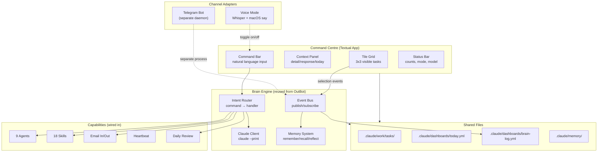

# Command Centre Architecture

> **Status:** BUILT — all 4 phases complete, bug-fixed 2026-03-01
> **Created:** 2026-02-28
> **Author:** Troy + Claude (Cursor)
> **Build target:** Claude Code (terminal TUI)
> **Survives interruption:** Yes — each phase is self-contained with clear done criteria

---

## 1. What We're Building

A **unified terminal interface** — codename "Command Centre" — that merges the task picker, OutBot brain, voice mode, agents, and skills into a single keyboard-driven TUI.

**One app. One process. Every capability accessible via hotkeys or natural language.**

### What Dies
- `task-picker.py` (standalone script) → absorbed into Command Centre
- `brain/chat.py` (standalone CLI) → absorbed into Command Centre
- `brain/voice.py` (standalone voice) → absorbed as a mode toggle

### What Lives (unchanged)
- `brain/main.py` → Telegram bot standalone mode (optional, can also run in-process)
- `brain/orchestrator.py` → reused as the brain engine
- All agents, skills, memory, events → wired in, not rewritten
- `brain/telegram/bot.py` → Telegram adapter (reused by in-process bridge)
- `brain/core/` → config, events, models, db all reused

---

## 2. Architecture Overview

```
┌──────────────────────────────────────────────────────────────┐
│                    COMMAND CENTRE (Textual TUI)               │
│                                                               │
│  ┌─────────┬─────────┬─────────┐  ┌─────────────────────┐   │
│  │  Tile 1 │  Tile 2 │  Tile 3 │  │                     │   │
│  │         │         │         │  │   CONTEXT PANEL      │   │
│  ├─────────┼─────────┼─────────┤  │                     │   │
│  │  Tile 4 │  Tile 5 │  Tile 6 │  │  - Today shortlist  │   │
│  │         │         │         │  │  - Task detail       │   │
│  ├─────────┼─────────┼─────────┤  │  - OutBot response   │   │
│  │  Tile 7 │  Tile 8 │  Tile 9 │  │  - Agent output      │   │
│  │         │         │         │  │                     │   │
│  └─────────┴─────────┴─────────┘  └─────────────────────┘   │
│                                                               │
│  ┌─────────────────────────────────────────────────────────┐ │
│  │ ⌘ COMMAND BAR: type here to talk to OutBot / run agents │ │
│  └─────────────────────────────────────────────────────────┘ │
│                                                               │
│  ┌─────────────────────────────────────────────────────────┐ │
│  │ STATUS: 25 tasks │ 3 today │ voice: off │ model: opus  │ │
│  └─────────────────────────────────────────────────────────┘ │
└──────────────────────────────────────────────────────────────┘
```

### Component Map



---

## 3. Tile Grid Design

### Layout: 3x3 Grid with Pagination

- **9 tiles visible** at any time
- Each tile shows: quadrant colour band, title (truncated), priority badge, due badge
- **Page left/right** with `[` and `]` to see more tasks (pages of 9)
- **Page indicator:** "Page 1 of 3 (25 tasks)"

### Tile States

| State | Visual | How to enter |
|---|---|---|
| **Normal** | Dim border | Default |
| **Focused** | Bright border, slight highlight | Arrow keys / number keys 1-9 |
| **Selected** | Green check overlay, bold border | `Space` or `Enter` on focused tile |
| **Today** | Green dot in corner | Already in today list |
| **Overdue** | Red pulse/badge | Automatic from due date |

### Selection Model (Multi-Select)

- `1-9` — focus tile by position
- `Space` — toggle select on focused tile
- `Enter` — **drill down**: parent task → show children, leaf task → open Task Focus View
- `a` — select all on current page
- `n` — deselect all
- Arrow keys — move focus between tiles
- `[` / `]` — page left / page right

### What Happens with Selections

Once tiles are selected (green check), the **command bar** becomes contextual:

| You type | What happens |
|---|---|
| *(just press `t`)* | Add selected to today shortlist |
| `make these better` | Claude enriches selected task descriptions |
| `research this` | Agent-browser fetches URLs from selected tasks |
| `what should I prioritise?` | Claude analyses selected + gives recommendation |
| `email Kate about these` | OutBot drafts email with selected task summaries |
| `done` | Mark selected as complete |
| `schedule for monday` | Set due dates on selected |
| `move to q1` | Reclassify Eisenhower quadrant |

---

## 4. Context Panel (Right Side)

The right panel changes based on what's happening:

| Mode | Shows |
|---|---|
| **Default** | Today shortlist (always visible at top) + task count summary |
| **Single focus** | Full task detail — description, steps, dates, parent/children |
| **OutBot response** | Claude's reply after a command bar message |
| **Agent output** | Live output from running agent/skill |
| **Voice active** | Waveform / "Listening..." / transcription |

### Today Shortlist (always pinned at top of context panel)

```
TODAY (3 tasks)
━━━━━━━━━━━━━━━━━━
● Morgan LinkedIn Post          Q1
● Tent poles                    Q3
● Get shit done                 Q2
━━━━━━━━━━━━━━━━━━
```

---

## 5. Command Bar

Always visible at the bottom. Press `:` to focus for filters, or just start typing for OutBot. `/` opens the **Command Palette** (a navigable modal with all commands, agents, and skills).

### Command Types

| Prefix | Purpose | Example |
|---|---|---|
| *(none)* | Natural language to OutBot | `what should I focus on?` |
| `/` | Slash commands (quick actions) | `/daily`, `/voice`, `/enrich` |
| `:` | Filter/search tasks | `:overdue`, `:q1`, `:kate` |

### Slash Commands

| Command | Action |
|---|---|
| `/daily` | Run daily review pipeline |
| `/voice` or `/v` | Toggle voice mode on/off |
| `/enrich` | Run enricher on selected tasks |
| `/research` | Run agent-browser on URL tasks |
| `/email [person]` | Draft email about selected tasks |
| `/done` | Mark selected as done |
| `/today` | Add selected to today |
| `/remove` | Remove selected from today |
| `/q1` `/q2` `/q3` `/q4` | Move selected to quadrant |
| `/sort [weight\|alpha\|due]` | Change sort order |
| `/filter [quadrant\|overdue\|tag]` | Filter tile grid |
| `/agent [name]` | Run a specific agent |
| `/skill [name]` | Invoke a skill |
| `/help` | Show all commands |

---

## 6. Hotkey Map

### Global (work everywhere)

| Key | Action |
|---|---|
| `Escape` | Multi-level: cancel edit → exit focus → pop nav → clear filter → clear select → quit |
| `v` | Toggle voice mode |
| `/` | **Command Palette** — filterable list of commands, agents, skills |
| `:` | Focus command bar (filter mode) |
| `?` | Show hotkey help overlay |

### Grid Navigation

| Key | Action |
|---|---|
| `1-9` | Focus tile by position |
| `Arrow keys` | Move focus |
| `Enter` | **Drill down** — parent → children, leaf → Task Focus View |
| `Space` | Toggle select on focused tile |
| `a` | Select all (current page) |
| `n` | Deselect all |
| `[` / `]` | Page left / right |
| `t` | Add selected/focused to today (toggles if already today) |
| `d` | Mark selected/focused as done (local + iOS) |
| `e` | Edit task (modal) |

### Task Focus View (single-task detail)

| Key | Action |
|---|---|
| `↑` / `↓` | Navigate between fields (title, quadrant, priority, due, status, parent, description, PRD, notes) |
| `Enter` | Edit field (text input) or cycle choice (quadrant/priority/status) |
| `Escape` | Stop editing → back to field list → back to grid |
| `n` | Add a timestamped note |
| `p` | Open/create PRD (Esc saves) |
| `t` | Add to today |
| `d` | Mark done |
| `Space` | Toggle select |
| `/` | Command Palette for this task |

### Command Palette (/ key)

| Key | Action |
|---|---|
| `↑` / `↓` | Navigate between items |
| `Enter` | Select item |
| Type | Filter items by name or description |
| `Escape` | Close palette |

Shows contextual suggestions based on current task, then slash commands, agents, and skills.

### Voice Mode (when active)

| Key | Action |
|---|---|
| `v` | Stop voice mode |
| `Enter` | Start/stop recording |
| `Escape` | Cancel current recording |

---

## 7. Brain Integration (the smart part)

### Event Logging (new file: `.claude/dashboards/brain-log.yml`)

Every interaction is logged:

```yaml
- timestamp: "2026-02-28T22:15:00"
  action: selected
  task_ids: [OUT-256, OUT-310]
  context: "morning triage"

- timestamp: "2026-02-28T22:15:30"
  action: command
  input: "make these better"
  task_ids: [OUT-256, OUT-310]
  result: enriched

- timestamp: "2026-02-28T22:16:00"
  action: added_to_today
  task_ids: [OUT-256]
```

### Pattern Learning

The brain watches the log and learns:
- **Time patterns:** "Troy picks work tasks in the morning, personal in the evening"
- **Grouping patterns:** "These tasks often get selected together"
- **Completion patterns:** "Q1 tasks get done, Q4 tasks get skipped repeatedly"
- **Prediction:** On next launch, pre-sort tiles by predicted likelihood of selection

### Predictive Today (Phase 3+)

On launch, the brain suggests a "predicted today" based on:
1. Day of week patterns
2. What's overdue
3. What was selected but not completed yesterday
4. Tasks similar to recently completed ones

Shown as: `[Brain suggests: OUT-256, OUT-310, OUT-308] Accept? (y/n)`

---

## 8. Voice Integration

Voice is a **mode**, not a separate app. Toggle with `v`.

### When Voice is Active

- Status bar shows: `🎙️ VOICE ON`
- Command bar label changes to: `⌘ SPEAK (Enter to record, v to stop voice)`
- `Enter` starts recording → `Enter` stops → transcription fills command bar → auto-submit
- OutBot replies are spoken via `macOS say` AND displayed in context panel
- All tile hotkeys still work (spatial + voice together)

### Voice Pipeline

```
[Enter] → record audio → Whisper STT → fill command bar → route intent → Claude → TTS (say) + display
```

Uses existing `brain/voice.py` functions: `record()`, `transcribe()`, `speak()` — just imported, not run as separate process.

---

## 9. Task Type Handlers (URL research, etc.)

Tasks with recognisable patterns trigger special handlers:

| Pattern | Handler | What it does |
|---|---|---|
| URL in title/description | `url-research` | Fetch URL via agent-browser, summarise, update task |
| "meeting with [name]" | `meeting-prep` | Check calendar, draft agenda |
| "email [name] about" | `email-draft` | Draft email via outbox |
| "research [topic]" | `deep-research` | Claude research + save findings to task |
| "buy [item]" | `shopping-list` | Extract item, flag as errand |

These are invoked automatically when you select a task and type `/research` or manually via the command bar.

---

## 10. File Structure (new/modified files)

```
brain/
├── command_centre/            # The unified TUI
│   ├── __init__.py            # PROJECT_ROOT definition
│   ├── __main__.py            # Entry point: python -m brain.command_centre
│   ├── app.py                 # Main Textual App (key handling, state, lifecycle)
│   ├── tile_grid.py           # 3x3 tile grid widget with focus/select states
│   ├── context_panel.py       # Right-side panel: today list, detail, responses
│   ├── command_bar.py         # Bottom command input widget
│   ├── status_bar.py          # Bottom status strip with counts + hints
│   ├── router.py              # Intent routing (slash cmd / natural language → handler)
│   ├── brain_logger.py        # Event logging with file locking for pattern learning
│   ├── task_loader.py         # Load/sort/filter tasks + find_task_file()
│   ├── config_loader.py       # Loads hotkeys + display from command-centre.yml
│   ├── sanitiser.py           # Cross-cutting client name sanitisation
│   ├── predictions.py         # Prediction engine (day-of-week, frequency, unfinished)
│   ├── telegram_bridge.py     # Runs Telegram bot in-process as background task
│   ├── command_palette.py     # Full-screen filterable command/agent/skill palette
│   ├── task_focus.py          # Single-task focus view with inline field editing
│   ├── task_editor.py         # Legacy modal editor (kept for backward compat)
│   ├── note_modal.py          # Quick note input modal
│   ├── skill_matcher.py       # Suggests agents/skills based on task content
│   └── handlers/
│       ├── __init__.py
│       ├── triage.py          # /done, /today, /remove, /q1-q4
│       ├── enrich.py          # /enrich — Claude enrichment of task descriptions
│       ├── research.py        # /research — URL fetch + Claude summarisation
│       ├── email.py           # /inbox, /import-emails, /email
│       ├── voice.py           # Voice mode toggle + audio pipeline
│       ├── daily_review.py    # /daily — 5-stage review pipeline
│       └── agent_runner.py    # /agent, /skill — list and describe
├── chat.py                    # DEPRECATED (kept for backward compat)
├── voice.py                   # KEPT (imported by handlers/voice.py)
├── main.py                    # KEPT (Telegram standalone mode, optional)
├── orchestrator.py            # KEPT (brain engine, reused by router + telegram)
└── ...                        # All other brain/ files unchanged

.claude/config/
└── command-centre.yml         # Hotkeys, display, behaviour config (optional)

.claude/dashboards/
├── today.yml                  # Today shortlist
├── brain-log.yml              # Interaction event log (file-locked)
└── predictions.yml            # Predicted today suggestions
```

---

## 11. How to Launch

```bash
# The one command to rule them all
python -m brain.command_centre

# Or with an alias (add to .zshrc)
alias cc="cd ~/CODE/AAGLOBAL && python -m brain.command_centre"

# Telegram bot is still separate (it's a daemon)
python brain/main.py
```

---

## 12. Build Phases

### Phase 1: Shell ✅ BUILT

**Files:** `app.py`, `tile_grid.py`, `context_panel.py`, `command_bar.py`, `status_bar.py`, `task_loader.py`, `config_loader.py`, `sanitiser.py`

**What was built:**
- Textual app with 2-column layout (tile grid + context panel)
- Loads tasks from `.claude/work/tasks/`, weight-sorted by quadrant + due date
- 3x3 tile grid with quadrant colours, overdue/today indicators
- Arrow keys / 1-9 navigation, `[` `]` pagination
- `Space` to toggle select, `a` select all, `n` deselect
- Today shortlist in context panel, `t` to add/toggle
- `d` to mark done (local + iOS Reminders sync)
- Status bar with counts, mode indicators, page info
- Configurable hotkeys via `command-centre.yml`
- Client name sanitisation on all display output
- `Escape` multi-level state machine (modal → focus → nav → filter → select → quit)

---

### Phase 2: Brain ✅ BUILT

**Files:** `router.py`, `brain_logger.py`, `command_palette.py`, `task_focus.py`, `task_editor.py`, `note_modal.py`, `skill_matcher.py`, `handlers/triage.py`, `handlers/enrich.py`, `handlers/research.py`, `handlers/daily_review.py`

**What was built:**
- Intent router: slash commands, natural language → Claude, filters
- `/done`, `/today`, `/remove`, `/q1-q4` triage commands
- `/enrich` — Claude enriches task descriptions
- `/research` — URL fetch + Claude summarisation, saved to task
- `/daily` — 5-stage pipeline (reminders, quadrants, overdue, email, dashboard)
- Brain logger with file locking (race-safe for TG + TUI)
- **Command Palette** (`/` key) — filterable modal with contextual suggestions, all commands, agents, skills
- **Task Focus View** (`Enter` on leaf) — single-task detail with inline field editing, choice cycling, debounced save
- Note modal + timestamped note appending
- PRD creation/editing from focus view (`p` key)
- Skill matcher — suggests relevant agents/skills based on task content
- Navigation stack — `Enter` on parent drills into children, `Escape` pops back
- AI progress tracking with elapsed time display

---

### Phase 3: Voice + Predictions ✅ BUILT

**Files:** `handlers/voice.py`, `predictions.py`, `telegram_bridge.py`

**What was built:**
- `v` toggles voice mode, status bar shows recording state
- Record → Whisper STT → route → Claude → TTS (macOS `say`) + display
- Prediction engine: day-of-week patterns, frequency, unfinished yesterday
- On launch: "Brain suggests" panel with `y` (accept) / `n` (dismiss)
- Telegram bridge running in-process as background async task

---

### Phase 4: Polish + Full Integration ✅ BUILT

**Files:** `handlers/agent_runner.py`, `handlers/email.py`

**What was built:**
- `/agent` and `/skill` — list and describe all 9 agents + 22 skills
- `/inbox` — check Gmail inbox
- `/import-emails` — import unread emails as tasks (syncs to iOS)
- `/email <msg>` — Claude extracts recipient/subject/body, sends via SMTP
- `/telegram <msg>` — send messages to Telegram chat
- Help overlay (`?` key) — comprehensive keybinding reference
- Telegram messages trigger OutBot responses (auto-reply)
- Robust error handling with try/except on all external modules

---

## 13. Dependency on Existing Code (what we reuse, not rewrite)

| Existing module | Reused for | Import path |
|---|---|---|
| Task loading + sorting | Tile grid data | Extract from `task-picker.py` → `task_loader.py` |
| `ClaudeClient` | All Claude calls | `brain.core.claude_client` |
| `PersonalityLoader` | OutBot personality | `brain.personality.loader` |
| `format_outbound` | Response formatting | `brain.personality.formatter` |
| `record`, `transcribe`, `speak` | Voice mode | `brain.voice` |
| `EventBus` | Internal events | `brain.core.events` |
| `Database` | Message history | `brain.core.db` |
| `Config` | All config | `brain.core.config` |
| `RemindersManager` | Task completion | `.claude.reminders.core.manager` |
| `run_daily_review` | Daily review | `brain.workflows.daily_review` |
| `remember`, `recall`, `reflect` | Memory system | `brain.memory.*` |
| `Inbox`, `Outbox` | Email | `brain.mail.*` |
| `SessionManager`, `SessionArchiver` | Session tracking | `brain.session.*` |

---

## 14. What to Tell Claude Code

When starting the build in Claude Code, say:

> "Read `docs/plans/2026-02-28-command-centre-architecture.md` and build Phase 1.
> The architecture doc has everything — file structure, component design, hotkey map,
> done criteria, and what existing code to reuse. Start with Phase 1 only."

After each phase, verify the done criteria, then say:

> "Phase 1 is working. Build Phase 2 now."

If you get interrupted mid-phase:
- The phase descriptions are self-contained
- Each file has a clear purpose listed
- The dependency table shows what to import
- The done criteria tell you what "finished" looks like

---

## 15. Design Decisions (RESOLVED)

1. **Tile size:** 3x3 (9 visible) — confirmed by Troy via mockup review
2. **Colour scheme:** Industrial dark palette (orange #FF6B35 + teal #00D4AA) — confirmed
3. **Sort order on launch:** Weight-based default, predicted in Phase 3
4. **Session archiving:** Yes — auto-archive like CLI chat
5. **Telegram bridge:** Yes — Telegram runs IN-PROCESS as a background task (see Section 16)

---

## 16. Telegram In-Process (No Separate Terminal)

The Command Centre runs Telegram **inside the same process** as a background async task.

### How It Works

```python
# On startup, Command Centre does:
async def start(self):
    # 1. Start the TUI (foreground)
    # 2. Start Telegram polling (background task)
    if config.telegram_token:
        asyncio.create_task(telegram_bot.start())
        asyncio.create_task(heartbeat_scheduler.start())
```

### What This Enables

- Launch ONE terminal → get both the tile grid AND Telegram bot
- Walk away from keyboard → Telegram keeps running on your phone
- From phone: "what's on my today list?" → OutBot reads `today.yml`
- From phone: "mark OUT-256 done" → task completed, tiles refresh on return
- From phone: "add research solar panels" → task created, appears in grid
- Heartbeat nudges still work (overdue reminders, etc.)

### Shared State

Both interfaces (TUI + Telegram) share:
- `today.yml` — today shortlist
- `brain-log.yml` — interaction log
- `.claude/work/tasks/` — task files
- `brain/core/db.py` — message history
- Memory system — remember/recall

The EventBus already supports this — Telegram events and TUI events both publish to the same bus.

### Lifecycle

```
Command Centre starts
├── TUI renders (foreground)
├── Telegram polling (background)
├── Heartbeat scheduler (background)
└── All share: EventBus, Database, Memory, Config

Command Centre stops (Escape twice)
├── Save today.yml
├── Archive session
├── Stop Telegram polling
├── Stop heartbeat
└── Clean shutdown
```

---

## 17. Sanitisation Layer (Client Name Protection)

Troy's existing sanitisation system (`.claude/scripts/sanitise_rules.yml` + `sanitise_pptx.py`)
gets elevated to a **cross-cutting concern** that protects ALL output paths.

### Rules File (existing, extended)

```yaml
# .claude/scripts/sanitise_rules.yml
replacements:
  - pattern: "Australian Super"
    replacement: "[Client]"
    case_insensitive: true
  - pattern: "Aus ?Super"
    replacement: "[Client]"
    case_insensitive: true
  - pattern: "Deloitte Digital"
    replacement: "[Consultant]"
    case_insensitive: true
  - pattern: "Deloitte"
    replacement: "[Consultant]"
    case_insensitive: true
  # Add more patterns as needed
```

### Where Sanitisation Runs

| Output path | When | What gets cleaned |
|---|---|---|
| **Tile titles** | On render | Task titles displayed in grid |
| **Context panel** | On render | Task descriptions, OutBot responses |
| **Command bar echo** | On display | User input echoed back |
| **Brain log** | On write | `brain-log.yml` entries |
| **Today list** | On write | `today.yml` task references |
| **Telegram messages** | On send | Any message sent to Telegram |
| **Session archives** | On save | Conversation logs |
| **Git commits** | Pre-commit hook | Commit messages and diffs |

### Implementation

```python
# brain/command_centre/sanitiser.py
# Reuses existing apply_replacements() from sanitise_pptx.py

from pathlib import Path
import re, yaml

_RULES_PATH = Path(".claude/scripts/sanitise_rules.yml")
_rules_cache: list[dict] | None = None

def load_rules() -> list[dict]:
    global _rules_cache
    if _rules_cache is None:
        data = yaml.safe_load(_RULES_PATH.read_text())
        _rules_cache = data.get("replacements", [])
    return _rules_cache

def sanitise(text: str) -> str:
    for rule in load_rules():
        flags = re.IGNORECASE if rule.get("case_insensitive", True) else 0
        text = re.sub(rule["pattern"], rule["replacement"], text, flags=flags)
    return text
```

Every display function and write function calls `sanitise()` before output.

---

## 18. Configurable Hotkeys and Interface

All hotkeys and display settings are stored in YAML, not hardcoded.

### Config File

```yaml
# .claude/config/command-centre.yml
hotkeys:
  toggle_voice: "v"
  add_to_today: "t"
  mark_done: "d"
  page_left: "["
  page_right: "]"
  command_bar: "/"
  filter_mode: ":"
  select_all: "a"
  deselect_all: "n"
  help: "?"
  drill_in: "enter"
  zoom_out: "backspace"

display:
  tiles_per_row: 3
  rows: 3
  colour_q1: "#FF6B35"
  colour_q2: "#00D4AA"
  colour_q3: "#777777"
  colour_q4: "#3D3D3D"
  colour_focused: "#FF6B35"
  colour_selected: "#00D4AA"
  colour_overdue: "#FF6B35"
  font_title: "bold"
  font_meta: "dim"

behaviour:
  auto_advance_on_select: true
  show_predictions_on_launch: true
  telegram_in_process: true
  voice_model: "base"
  sanitise_output: true
```

### How It Works

- On launch, Command Centre reads this YAML
- Textual bindings are built dynamically from the `hotkeys` section
- Display settings feed into tile rendering
- Change a key → restart → done. No code changes.
- If the file doesn't exist, sensible defaults are used

---

## Appendix A: Current System Inventory

### What exists and works today

| Component | Status | Location |
|---|---|---|
| Task picker (card swiper) | Working, limited | `.claude/scripts/task-picker.py` |
| OutBot CLI chat | Working | `brain/chat.py` |
| OutBot voice | Working | `brain/voice.py` |
| OutBot Telegram | Working | `brain/main.py` + `brain/telegram/bot.py` |
| Heartbeat scheduler | Working | `brain/heartbeat/scheduler.py` |
| Memory (remember/recall) | Working | `brain/memory/` |
| Email (inbox/outbox) | Working | `brain/mail/` |
| Daily review | Working | `brain/workflows/daily_review.py` |
| 9 agents | Defined, invocable via Claude Code | `.claude/agents/` |
| 18 skills | Defined, invocable via Claude Code | `.claude/skills/` |
| Event bus | Working | `brain/core/events.py` |
| Task registry | Working | `.claude/work/task-registry.yml` |
| Reminders sync | Working | `.claude/reminders/` |

### What's missing (Command Centre fills these gaps)

| Gap | Solution |
|---|---|
| No spatial overview of tasks | 3x3 tile grid |
| No multi-select | Space to toggle, `a` for all |
| No command input in picker | Command bar with natural language |
| No brain watching selections | Brain logger + pattern learning |
| No voice in picker | Mode toggle with `v` |
| No agent/skill access from picker | `/agent` and `/skill` commands |
| No URL task research | `/research` handler |
| No predictions | Brain reads log, suggests today |
| Picker and OutBot are separate | One unified app |
